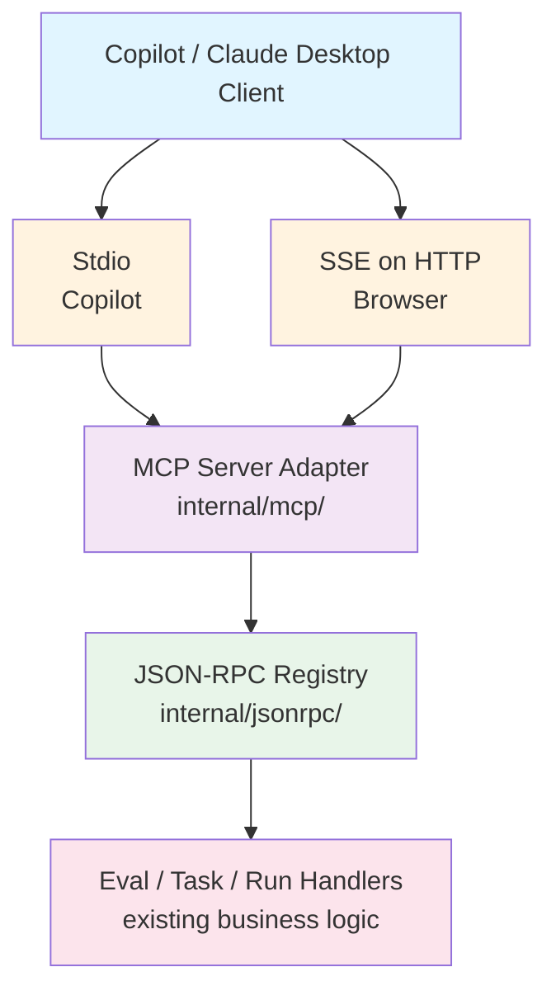

# MCP Server Design Document

**Date:** 2026-02-21  
**Architect:** Rusty  
**Status:** Design Ready for Implementation  

---

## 1. Architecture Overview

Waza embeds an MCP server that launches automatically with `waza serve`. The server uses a thin adapter layer over existing JSON-RPC handlers, providing two transport options:


---

## 2. MCP Tools (10 existing + 2 new)

| Tool | Input Schema | Purpose |
|------|--------------|---------|
| `eval.list` | `{}` | List all evals in registry |
| `eval.get` | `{ "id": string }` | Fetch eval spec and metadata |
| `eval.validate` | `{ "yaml": string }` | Validate eval YAML syntax |
| `eval.run` | `{ "id": string, "params": object }` | Start eval execution |
| `task.list` | `{ "eval_id": string }` | List tasks in eval |
| `task.get` | `{ "eval_id": string, "id": string }` | Get task definition |
| `run.status` | `{ "run_id": string }` | Poll execution status |
| `run.cancel` | `{ "run_id": string }` | Stop running eval |
| `run.results` | `{ "run_id": string }` | Fetch full eval results |
| `model.list` | `{}` | List available AI models |
| **`results.summary`** *(new)* | `{ "run_id": string, "format": "markdown" \| "json" }` | Summarize eval results (pass rate, model comparison, error patterns) |
| **`skill.check`** *(new)* | `{ "skill_name": string }` | Validate skill YAML/frontmatter, return compliance score & suggestions |

---

## 3. Transport Modes

### 3.1 Stdio (Primary)
- **Audience:** Copilot CLI, Claude Desktop, code editors
- **Protocol:** MCP over stdin/stdout
- **Launch:** Auto-started by `waza serve`
- **Lifecycle:** Runs for duration of client session

### 3.2 Server-Sent Events (SSE)
- **Audience:** Web UI, browser-based clients
- **Endpoint:** `GET /mcp/events` (streaming)
- **Protocol:** SSE for tool notifications + RPC-style request/response via HTTP POST to `/mcp/call`
- **Auth:** None (local development); TLS+token for production
- **Use Case:** Dashboard real-time updates, progress notifications

---

## 4. Integration with `waza serve`

```bash
waza serve
# Launches HTTP server on :8080 (web UI)
# Launches MCP server on stdio automatically
# Listens for SSE connections on :8080/mcp/events
```

**No flag needed** — MCP is always on as a core feature.

### 4.1 Server Startup Flow

1. `cmd/waza/main.go` parses `serve` subcommand
2. Initializes `internal/jsonrpc.Server` (existing)
3. Wraps with `internal/mcp.Adapter` (new thin layer)
4. Spawns stdio transport handler
5. Starts HTTP server with SSE route
6. Blocks until shutdown signal

---

## 5. Example MCP Configuration

Save to `~/.copilot/mcp.json`:

```json
{
  "mcpServers": {
    "waza": {
      "command": "waza",
      "args": ["serve"],
      "env": {
        "WAZA_MCP_STDIO": "1",
        "WAZA_LOG_LEVEL": "info"
      },
      "disabled": false
    }
  }
}
```

Copilot will:
1. Launch `waza serve`
2. Communicate with MCP over stdio
3. Call tools and cache results
4. Display results inline in chat

---

## 6. Workflow Scenarios (Interactive Skill #288)

The **waza interactive skill** orchestrates multi-step workflows by chaining MCP tool calls:

### Scenario 1: Create and Run an Eval
```
User: "Compare GPT-4o vs Claude 3.5 on code generation"
  ├─ skill.check("my-eval")  ← Validate eval YAML
  ├─ eval.run({"id": "my-eval", "params": {...}})  ← Start execution
  ├─ [poll] run.status({"run_id": "run-123"})  ← Check progress (loop)
  └─ results.summary({"run_id": "run-123"})  ← Summarize when done
```

### Scenario 2: Investigate Eval Results
```
User: "Why did task 5 fail?"
  ├─ run.results({"run_id": "run-123"})  ← Fetch full results
  ├─ task.get({"eval_id": "my-eval", "id": "task-5"})  ← Get task definition
  └─ [LLM analysis] Parse error logs, suggest fixes
```

### Scenario 3: Compare Multiple Runs
```
User: "Compare my last two eval runs"
  ├─ results.summary({"run_id": "run-121", "format": "json"})
  ├─ results.summary({"run_id": "run-122", "format": "json"})
  └─ [LLM comparison] Side-by-side model performance
```

---

## 7. Implementation Phases

### Phase 1: Adapter Layer (Weeks 1-2)
- ✅ Create `internal/mcp/adapter.go` — thin wrapper over JSON-RPC registry
- ✅ Implement stdio transport (use standard MCP Go SDK)
- ✅ Wire into `waza serve` command
- ✅ Add tests for tool dispatch

**Deliverable:** `waza serve` launches MCP over stdio; tools respond correctly.

### Phase 2: New Tools (Weeks 2-3)
- ✅ Implement `results.summary` handler
  - Aggregates pass/fail rates per model
  - Extracts error patterns
  - Formats as markdown or JSON
- ✅ Implement `skill.check` handler
  - Calls existing skill validator
  - Returns compliance score + frontmatter suggestions
- ✅ Add input validation schemas for all 12 tools

**Deliverable:** All 12 tools functional; integration tests passing.

### Phase 3: SSE Transport (Weeks 3-4)
- ✅ Add `/mcp/events` SSE endpoint
- ✅ Implement progress notifications (runs starting, completing)
- ✅ Add `/mcp/call` HTTP POST for async requests
- ✅ Document browser client integration

**Deliverable:** Web dashboard receives real-time run updates.

### Phase 4: Interactive Skill (Week 4+)
- Implement skill at `skills/waza-interactive/` 
- Skill calls MCP tools via chained prompts
- Test workflows (scenarios from section 6)
- Update waza skill documentation

**Deliverable:** Skill available in Copilot; can orchestrate full eval workflows.

---

## 8. Key Design Decisions

| Decision | Rationale |
|----------|-----------|
| **Always-on MCP** | Simplifies UX; MCP is core feature, not opt-in |
| **Thin adapter** | Reuse existing JSON-RPC logic; reduce duplication |
| **Stdio primary** | Supports Copilot CLI and Claude Desktop natively |
| **SSE secondary** | Web UI gets real-time updates without polling |
| **Two new tools** | Skill needs aggregation (results.summary) + validation (skill.check) |
| **No auth (local)** | Development-first; add TLS+token for production |

---

## 9. Error Handling

MCP errors follow standard format:

```json
{
  "jsonrpc": "2.0",
  "error": {
    "code": -32600,
    "message": "Invalid request",
    "data": {
      "reason": "eval not found",
      "eval_id": "nonexistent"
    }
  },
  "id": 1
}
```

Adapter maps JSON-RPC errors (400-level) to MCP error codes (-32xxx).

---

## 10. Success Criteria

- [ ] `waza serve` launches MCP over stdio
- [ ] All 12 tools respond with correct schemas
- [ ] Copilot CLI can call tools end-to-end
- [ ] `results.summary` aggregates results correctly
- [ ] `skill.check` validates evals
- [ ] SSE transport streams updates
- [ ] Interactive skill can orchestrate a full eval workflow
- [ ] Documentation updated (MCP architecture, tool reference, example workflows)

