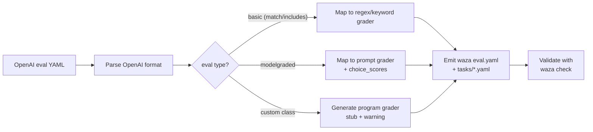
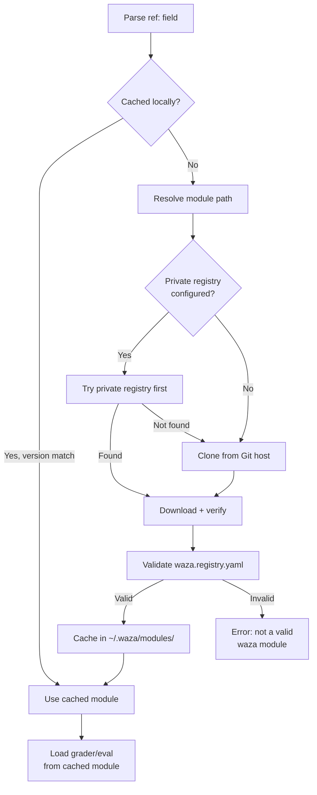
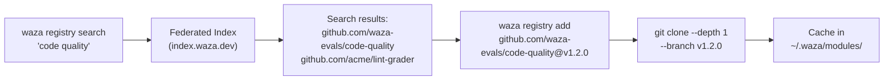
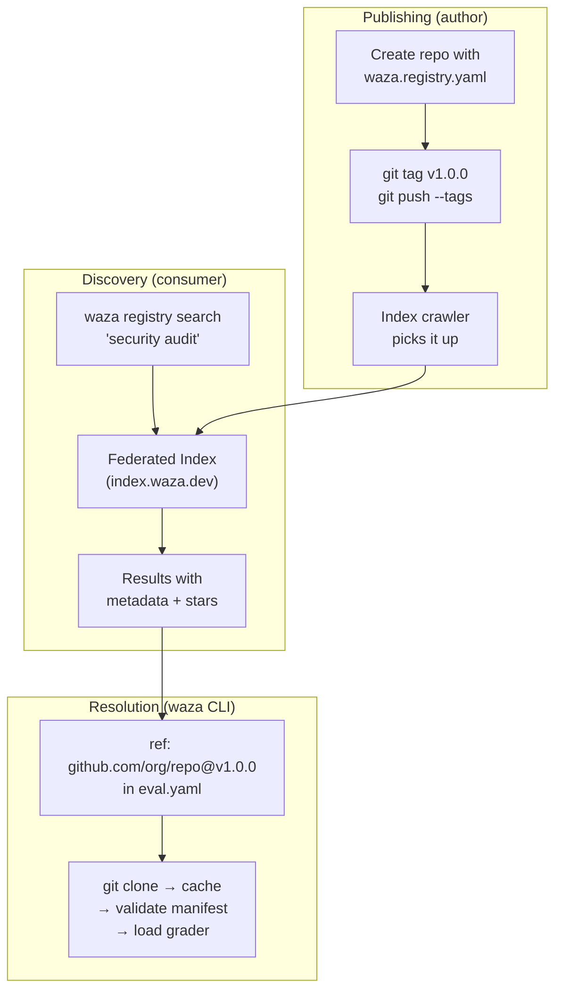
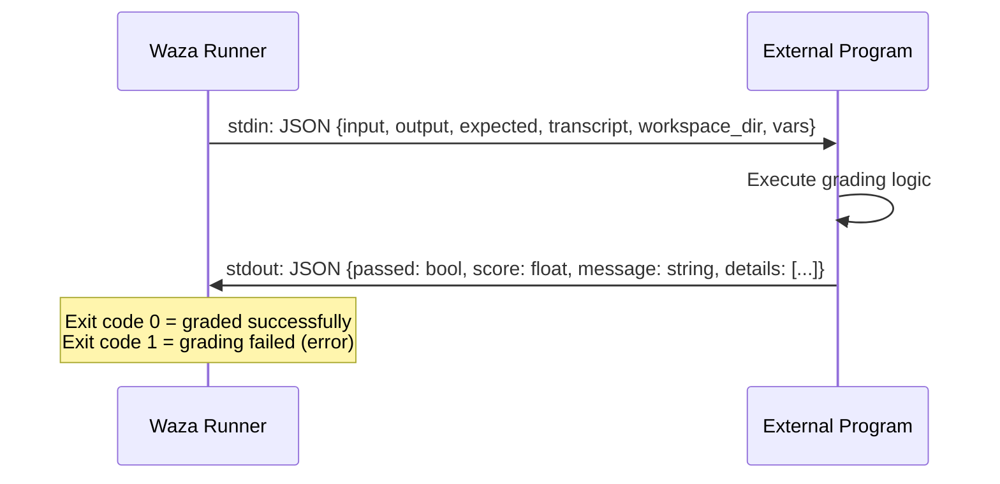
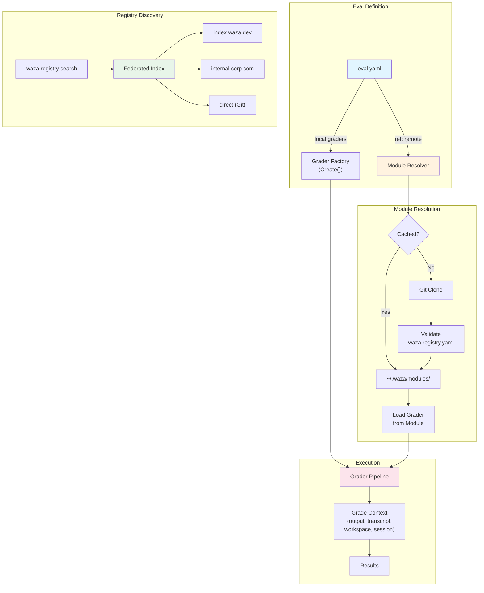

# Waza Eval & Grader Registry Design

**Date:** February 25, 2026
**Author:** Rusty (Lead/Architect), requested by Shayne Boyer
**Status:** Draft — addresses GitHub issues #385–#390
**Context:** waza v0.8.0 · Competitive gap analysis from `docs/research/waza-vs-openai-evals.md`

---

## 1. Executive Summary

Waza has 11 grader types, agent-native architecture, and a better eval story than OpenAI Evals in 15 of 20 dimensions. But we're losing on two: **community ecosystem** (gap #10 — OpenAI has 800+ shared evals, we have zero) and **custom extensibility** (gap #15 — they have Python class inheritance, we have config-only).

This design closes both gaps with a single architecture: **a decentralized, Go-module-style registry** where Git repos *are* the packages. No central JSON file. No single-point-of-failure registry server. You point at a repo and that IS your grader or eval — the same way `go get` works.

### What We're Building

| Component | Issue | Summary |
|-----------|-------|---------|
| OpenAI Evals Import | #386 | `waza import openai-evals` converts their format to ours |
| Go-Module-Style Refs | #387 | `ref: github.com/org/repo@v1.2.0` in eval.yaml resolves remote graders/evals |
| Registry Backend | #388 | Repos-as-registry with federated index for discovery |
| Composable Evals | #389 | Build evals from a menu of known graders |
| Grader Plugin Extensibility | #390 | WASM + external program graders for arbitrary logic |

### Design Principles

1. **Repos are packages.** A Git repo with a `waza.registry.yaml` manifest is a grader/eval package. Period.
2. **Agent-eval-native.** We evaluate *agents*, not completions. Don't cargo-cult OpenAI's completion-era patterns.
3. **Composability over inheritance.** Build evals from known graders. Don't subclass — compose.
4. **Offline-first.** Everything works air-gapped. The index is for discovery, not resolution.
5. **No central bottleneck.** No single JSON file. No registry server that can go down.

---

## 2. OpenAI Evals Format Mapping (#386)

### 2.1 Field-Level Translation Table

| OpenAI Evals Field | Waza Equivalent | Notes |
|---|---|---|
| `eval.id` | `name` | Direct map |
| `eval.description` | `description` | Direct map |
| `eval.metrics: [accuracy]` | `metrics[].name` | Waza metrics are richer (weight, threshold) |
| `eval.class` (Python path) | `graders[].type` + `graders[].config` | Class → grader config decomposition |
| `modelgraded.prompt` | `graders[].type: prompt` + `graders[].config.rubric` | Rubric-based prompt grader |
| `modelgraded.choice_strings` | `graders[].config.choices` | New field on prompt grader |
| `modelgraded.choice_scores` | `graders[].config.choice_scores` | Map of choice → float score |
| `modelgraded.eval_type: cot_classify` | `graders[].config.chain_of_thought: true` | CoT flag on prompt grader |
| `modelgraded.input_outputs` | N/A — waza passes full grading context | Waza's `Context` struct is richer |
| `completion_fns` | `config.executor` + `config.model` | Waza separates executor from model |
| `data/*.jsonl` | `tasks/*.yaml` or `tasks_from: data.csv` | YAML tasks or CSV datasets |

### 2.2 Concrete Translation: `fact.yaml`

**OpenAI Evals (modelgraded/fact.yaml):**
```yaml
fact:
  prompt: |-
    You are comparing a submitted answer to an expert answer...
    [Question]: {input}
    [Expert]: {ideal}
    [Submission]: {completion}
  choice_strings: ABCDE
  input_outputs:
    input: completion
```

**Waza equivalent:**
```yaml
graders:
  - type: prompt
    name: fact_check
    config:
      rubric: |-
        You are comparing a submitted answer to an expert answer on a given question.
        [Question]: {{.Input}}
        [Expert]: {{.Expected}}
        [Submission]: {{.Output}}
        Compare the factual content of the submitted answer with the expert answer.
        Grade as:
        (A) subset and consistent
        (B) superset and consistent
        (C) same details
        (D) disagreement
        (E) differences don't matter
      choices: ["A", "B", "C", "D", "E"]
      choice_scores:
        A: 0.8
        B: 0.8
        C: 1.0
        D: 0.0
        E: 0.6
      chain_of_thought: true
```

**Key differences:**
- Waza uses Go template syntax (`{{.Output}}`) instead of Python f-string placeholders (`{completion}`)
- Waza's grading context is richer — `{{.Input}}`, `{{.Expected}}`, `{{.Output}}`, `{{.Transcript}}`, `{{.Session}}`
- `choice_scores` gives weighted grading instead of just classification

### 2.3 Concrete Translation: `closedqa.yaml`

**OpenAI Evals (modelgraded/closedqa.yaml):**
```yaml
closedqa:
  prompt: |-
    You are assessing a submitted answer on a given task based on a criterion...
    [Task]: {input}
    [Submission]: {completion}
    [Criterion]: {criteria}
  eval_type: cot_classify
  choice_scores:
    "Y": 1.0
    "N": 0.0
  choice_strings: 'YN'
```

**Waza equivalent:**
```yaml
graders:
  - type: prompt
    name: closed_qa
    config:
      rubric: |-
        You are assessing a submitted answer on a given task based on a criterion.
        [Task]: {{.Input}}
        [Submission]: {{.Output}}
        [Criterion]: {{.Vars.criteria}}
        Does the submission meet the criterion?
        First, write out in a step-by-step manner your reasoning to be sure that your
        conclusion is correct. Avoid simply stating the correct answer at the outset.
        Then print only "Y" or "N".
      choices: ["Y", "N"]
      choice_scores:
        "Y": 1.0
        "N": 0.0
      chain_of_thought: true
```

**Notable:** `{criteria}` maps to `{{.Vars.criteria}}` — waza's template variable system supports arbitrary user-defined variables via the `vars` map on tasks.

### 2.4 Concrete Translation: `battle.yaml`

**OpenAI Evals (modelgraded/battle.yaml):**
```yaml
battle:
  prompt: |-
    You are comparing two responses to two instructions...
    [Instruction 1] {input1}  [Response 1] {completion1}
    [Instruction 2] {input2}  [Response 2] {completion2}
    Is the first response better?
  choice_strings: ["Yes", "No"]
  choice_scores:
    "Yes": 1.0
    "No": 0.0
```

**Waza equivalent:**

Battle evals don't map 1:1 — they compare two *completions*, which is a completion-era pattern. In waza's agent-native model, the equivalent is **cross-run comparison**: compare outputs from two different models or configs on the same task.

```yaml
# battle-eval.yaml — agent-native pairwise comparison
name: battle-comparison
description: Pairwise comparison of agent outputs across two configurations

graders:
  - type: prompt
    name: pairwise_judge
    config:
      rubric: |-
        You are comparing two agent responses to the same task.
        [Task]: {{.Input}}
        [Response A]: {{.Vars.response_a}}
        [Response B]: {{.Vars.response_b}}
        Which response better accomplishes the task? Consider:
        - Correctness of the solution
        - Quality of explanation
        - Appropriate tool usage
        Respond with "A" or "B" and explain your reasoning.
      choices: ["A", "B"]
      choice_scores:
        "A": 1.0
        "B": 0.0
      chain_of_thought: true
```

**Agent-native alternative:** Use `waza compare` to diff runs, then grade the comparison. This is more natural than cramming two outputs into a single prompt. The battle pattern is a legacy of completion-era A/B testing.

### 2.5 Import Command: `waza import openai-evals`

```bash
# Import a single eval definition
waza import openai-evals --source ./evals/registry/evals/test-basic.yaml

# Import a modelgraded config
waza import openai-evals --source ./evals/registry/modelgraded/fact.yaml

# Bulk import from cloned OpenAI Evals repo
waza import openai-evals --source ./evals/registry/ --output ./imported/
```

**Import pipeline:**



**What translates cleanly:** Basic match/includes evals, modelgraded rubrics (fact, closedqa, battle patterns), JSONL datasets → CSV tasks.

**What requires manual work:** Custom Python `evals.Eval` subclasses (emit a stub `program` grader with TODO comments), CompletionFn-specific configs, Snowflake logging configs.

---

## 3. Go-Module-Style References (#387)

### 3.1 The `ref:` Syntax

Graders and evals can reference remote packages using Go-module-style paths:

```yaml
# eval.yaml — referencing remote graders
graders:
  # Remote grader from a published package
  - ref: github.com/waza-evals/code-quality@v1.2.0
    name: code_quality_check

  # Remote grader with local config override
  - ref: github.com/myorg/custom-graders@v2.0.0#security-audit
    name: security_check
    config:
      severity: high
      ruleset: owasp-top-10

  # Local grader (unchanged from today)
  - type: regex
    name: no_errors
    config:
      must_not_match: ["(?i)fatal error"]

  # Remote eval (import entire eval spec)
  - ref: github.com/waza-evals/skill-baseline@v1.0.0
```

**Syntax breakdown:**

```
ref: {module_path}@{version}#{grader_name}
      └── repo path  └── semver  └── optional: specific grader within package
```

| Component | Required | Example | Notes |
|-----------|----------|---------|-------|
| Module path | Yes | `github.com/waza-evals/code-quality` | Git-clonable path |
| Version | Yes (pinned) | `@v1.2.0` | Semver tag. `@latest` allowed but discouraged |
| Fragment | No | `#security-audit` | Selects specific grader from multi-grader package |

### 3.2 Resolution Algorithm



**Resolution steps:**

1. **Parse** — Extract module path, version, fragment from `ref:` string
2. **Cache check** — Look in `~/.waza/modules/{module_path}@{version}/`
3. **Fetch** — `git clone --depth 1 --branch {version} https://{module_path}.git`
4. **Validate** — Confirm `waza.registry.yaml` exists and is valid
5. **Cache** — Store in `~/.waza/modules/` keyed by path@version
6. **Load** — Parse manifest, locate grader/eval, return config

### 3.3 Caching Strategy

```
~/.waza/
├── modules/                               # Module cache (like GOMODCACHE)
│   ├── github.com/
│   │   ├── waza-evals/
│   │   │   └── code-quality@v1.2.0/     # Immutable once cached
│   │   │       ├── waza.registry.yaml
│   │   │       ├── graders/
│   │   │       └── evals/
│   │   └── myorg/
│   │       └── custom-graders@v2.0.0/
│   └── gitlab.com/
│       └── ...
├── modules.lock                           # Lock file (like go.sum)
└── config.yaml                            # Registry settings
```

**Cache rules:**
- Versioned modules are **immutable** — once `@v1.2.0` is cached, it's never re-fetched
- `@latest` resolves to a specific version at fetch time and caches that version
- `waza registry clean` purges the cache
- `waza registry update` refreshes `@latest` references

### 3.4 Version Pinning and Lock Files

`waza.lock` lives next to `eval.yaml` and records exact resolved versions:

```yaml
# waza.lock — auto-generated, committed to source control
modules:
  - ref: github.com/waza-evals/code-quality@v1.2.0
    resolved: v1.2.0
    hash: sha256:a1b2c3d4e5f6...
    fetched: 2026-02-25T10:30:00Z

  - ref: github.com/myorg/custom-graders@v2.0.0
    resolved: v2.0.0
    hash: sha256:f6e5d4c3b2a1...
    fetched: 2026-02-25T10:30:00Z
```

`waza run` verifies hashes against lock file. If mismatched: error with `--force` override.

---

## 4. Registry Backend Evaluation (#388)

Shayne explicitly rejected a single JSON file. Good — centralized registries are single points of failure. Here are four real options.

### 4.1 Option A: Go Module Proxy Pattern (Repos ARE the Registry)

**How it works:** Every grader/eval package is a Git repo with a `waza.registry.yaml` manifest. Discovery happens through a federated index (like GOPROXY). Resolution is direct Git clone.



| Dimension | Assessment |
|-----------|------------|
| **Pros** | Zero infrastructure to publish (push a repo = published). Immutable versions via git tags. Works with any Git host. Familiar to Go developers. Private repos work with existing git auth. |
| **Cons** | Discovery requires separate index. No download counts without index proxy. Slightly slower first-fetch (git clone vs HTTP GET). |
| **Complexity** | Low for publishers, medium for index infrastructure |
| **Air-gapped** | ✅ Clone repos into internal Git server. No external dependency. |

### 4.2 Option B: OCI Artifacts (ghcr.io / ACR)

**How it works:** Package graders/evals as OCI artifacts. Push to any OCI registry (GHCR, ACR, Docker Hub). Pull with standard OCI tooling.

| Dimension | Assessment |
|-----------|------------|
| **Pros** | Industry-standard distribution. Signing via cosign/notation. Size-efficient (layer dedup). |
| **Cons** | Alien to eval authors (Docker concepts for YAML files?). Requires registry account. Publishing workflow is heavier. Overkill for small YAML+script packages. |
| **Complexity** | High for publishers, medium for consumers |
| **Air-gapped** | ✅ Standard OCI mirror patterns. |

### 4.3 Option C: GitHub Releases + Topics

**How it works:** Repos use `waza-grader` or `waza-eval` GitHub topics. Releases contain artifacts. Discovery via GitHub API topic search.

| Dimension | Assessment |
|-----------|------------|
| **Pros** | Zero new infrastructure. GitHub's search is the index. Release assets are versioned. |
| **Cons** | GitHub-only (excludes GitLab, Bitbucket, self-hosted). API rate limits. Topic-based search is noisy. No cross-host federation. |
| **Complexity** | Low for publishers, low for consumers |
| **Air-gapped** | ❌ Depends on GitHub API. No mirror pattern. |

### 4.4 Option D: Federated Index (GOPROXY-Style)

**How it works:** A lightweight index service that catalogues module metadata. Doesn't host packages — just points to them. Multiple index servers can be chained (like GOPROXY=proxy1,proxy2,direct).

```
WAZAREGISTRY=https://index.waza.dev,https://internal.corp.com/waza,direct
```

| Dimension | Assessment |
|-----------|------------|
| **Pros** | Best discovery experience. Download stats. Curated collections. Chainable (public + private). Package validation on index. |
| **Cons** | Requires running a service. Index can lag behind source repos. Another thing to maintain. |
| **Complexity** | Medium for publishers (just push repo), high for index operators |
| **Air-gapped** | ✅ Run internal index server pointing at internal Git. |

### 4.5 Recommendation: A + D (Repos-as-Registry + Federated Index)

**Git repos are the package format.** A `waza.registry.yaml` in a repo makes it a waza module. Period. This is Option A — the foundation.

**Federated index for discovery.** Option D layered on top for `waza registry search`. The index is optional — you can always `waza registry add github.com/foo/bar@v1.0` directly if you know the repo.

**Why not B (OCI)?** Overkill. We're distributing YAML files and small scripts, not container images. OCI adds cognitive overhead without proportional benefit. If someone wants OCI distribution later, it can be added as an alternative transport without changing the module format.

**Why not C (GitHub-only)?** Too coupled. Waza is model-agnostic — it should be host-agnostic too.



**Phase plan:**
1. **Phase 1:** Repos-as-registry only. `ref:` resolution via direct git clone. No index.
2. **Phase 2:** Public index at `index.waza.dev`. Crawler that discovers repos via GitHub/GitLab APIs + manual submission.
3. **Phase 3:** Federated index chaining. Private index support for enterprises.

---

## 5. Composable Eval Construction (#389)

### 5.1 The Problem

Today, writing an eval means writing every grader from scratch in your `eval.yaml`. Even if 80% of agent evals need the same checks (output not empty, no errors, reasonable token usage, skill actually invoked), every author re-implements them.

### 5.2 Composable Eval Patterns

**Pattern 1: Import graders from registry**

```yaml
# eval.yaml — composing from registry graders
name: my-skill-eval
graders:
  # Standard quality checks (from registry)
  - ref: github.com/waza-evals/standard-checks@v1.0.0#output-not-empty
  - ref: github.com/waza-evals/standard-checks@v1.0.0#no-error-patterns
  - ref: github.com/waza-evals/standard-checks@v1.0.0#reasonable-tokens
    config:
      max_tokens: 50000

  # Domain-specific grader (from registry)
  - ref: github.com/waza-evals/security-audit@v2.1.0
    config:
      ruleset: owasp-top-10

  # My custom grader (local)
  - type: regex
    name: has_fix_applied
    config:
      must_match: ["TODO removed"]
```

**Pattern 2: Eval presets (full eval templates)**

```yaml
# eval.yaml — extending a preset
extends: github.com/waza-evals/skill-baseline@v1.0.0

name: my-skill-eval
skill: my-awesome-skill

# Override or add to the preset's graders
graders:
  # Additional graders beyond the baseline
  - type: file
    name: check_output_files
    config:
      must_exist: ["output.json"]
```

**Pattern 3: Grader groups (named bundles)**

```yaml
# In waza.registry.yaml of a grader package
groups:
  quality-gate:
    description: Standard quality checks for any agent skill eval
    graders:
      - name: output-not-empty
        type: code
        config:
          assertions: ["len(output) > 0"]
      - name: no-error-patterns
        type: regex
        config:
          must_not_match: ["(?i)fatal error|crashed|exception|panic"]
      - name: reasonable-duration
        type: behavior
        config:
          max_duration_ms: 60000
```

Usage:
```yaml
graders:
  - ref: github.com/waza-evals/standard-checks@v1.0.0#quality-gate
    # Imports all graders in the group
```

### 5.3 CLI UX for Composing Evals

```bash
# Browse available grader packages
waza registry search "security"
#   github.com/waza-evals/security-audit  v2.1.0  ★ 47  OWASP-based security grading
#   github.com/acme/vuln-scanner          v1.0.0  ★ 12  CVE scanning grader
#   github.com/myorg/internal-security    v3.2.1  ★ 8   Internal security policy checks

# Inspect a package before adding
waza registry info github.com/waza-evals/security-audit@v2.1.0
#   Name:        security-audit
#   Description: OWASP-based security grading for agent code output
#   Graders:     security-audit, cve-check, dependency-scan
#   Groups:      full-audit (all 3 graders)
#   Version:     v2.1.0
#   License:     MIT

# Add to your eval interactively
waza registry add github.com/waza-evals/security-audit@v2.1.0
#   Added ref to eval.yaml. Run `waza run` to test.

# Scaffold a new eval from known graders
waza init --from-registry
#   ? Select grader packages to include:
#     [x] github.com/waza-evals/standard-checks  (quality gate)
#     [x] github.com/waza-evals/security-audit    (security)
#     [ ] github.com/waza-evals/code-style        (style checks)
#   Generated eval.yaml with 5 graders from 2 packages.
```

### 5.4 `extends` Semantics

When an eval uses `extends`:

1. **Load base eval** from the referenced module
2. **Merge graders** — local graders are appended after base graders
3. **Override config** — local `config:` fields override base fields (shallow merge)
4. **Override tasks** — if local `tasks:` is specified, it replaces base tasks entirely
5. **Override metrics** — if local `metrics:` is specified, it replaces base metrics entirely

**Conflict resolution:** Local always wins. No deep merge — if you override `config`, you override the whole `config` block. This is intentional — predictable > clever.

---

## 6. Grader Plugin Extensibility (#390)

### 6.1 Options Analysis

| Approach | Pros | Cons | Verdict |
|----------|------|------|---------|
| **WASM plugins** | Sandboxed, cross-platform, language-agnostic | Limited I/O (no filesystem by default), large runtime overhead for small graders, immature Go WASM hosts | **Phase 2** — good future option once WASI matures |
| **External programs** | Any language, zero coupling, battle-tested pattern | Process spawn overhead, IPC complexity, error handling surface area | **Phase 1** — already partially implemented (`program` grader) |
| **Go plugins** | Native speed, shared memory | Linux/macOS only, brittle ABI, rebuild on Go version change, effectively dead in the Go ecosystem | **No** — too fragile |
| **Embedded scripting** | Fast, in-process, familiar | Another runtime to maintain, security sandbox concerns | **Phase 2** — consider Starlark or Expr |

### 6.2 Recommendation: External Programs (Phase 1) + WASM (Phase 2)

**Phase 1: Enhanced `program` grader.** We already have `GraderKindProgram`. Extend it with a well-defined protocol:

```yaml
graders:
  - type: program
    name: custom_security_audit
    config:
      command: "./graders/security-audit.sh"
      args: ["--severity", "high"]
      timeout: 30
      # New: structured protocol
      protocol: waza-grader-v1
```

**Waza Grader Protocol v1:**



**stdin payload:**
```json
{
  "protocol": "waza-grader-v1",
  "input": "the task prompt",
  "output": "the agent's output",
  "expected": "expected output if any",
  "transcript": [...],
  "workspace_dir": "/tmp/waza-abc123",
  "session": {"tool_call_count": 5, "total_tokens": 1200},
  "vars": {"custom_key": "custom_value"}
}
```

**stdout response:**
```json
{
  "passed": true,
  "score": 0.85,
  "message": "Security audit passed with 2 warnings",
  "details": [
    {"check": "sql-injection", "passed": true, "message": "No SQL injection detected"},
    {"check": "xss", "passed": true, "message": "Output properly escaped"},
    {"check": "hardcoded-secrets", "passed": false, "message": "Warning: potential API key in output", "severity": "warning"}
  ]
}
```

**Phase 2: WASM graders.** Once WASI preview 2 is stable in Go's ecosystem:

```yaml
graders:
  - type: wasm
    name: custom_analyzer
    config:
      module: "./graders/analyzer.wasm"
      # Or from registry:
      module: "github.com/waza-evals/wasm-graders@v1.0.0#analyzer.wasm"
```

### 6.3 Registry Packages Can Ship Programs

A `waza.registry.yaml` can include program graders:

```yaml
# waza.registry.yaml in a grader repo
name: security-audit
graders:
  - name: owasp-check
    type: program
    config:
      command: "./bin/owasp-check"
      protocol: waza-grader-v1
    platforms:
      - os: linux
        arch: amd64
        binary: "./bin/owasp-check-linux-amd64"
      - os: darwin
        arch: arm64
        binary: "./bin/owasp-check-darwin-arm64"
```

Multi-platform binaries in the repo. The registry module resolution picks the right binary for the current platform.

---

## 7. Waza Registry Manifest: `waza.registry.yaml`

Every waza module repo must contain a `waza.registry.yaml` at the root.

### 7.1 Full Schema

```yaml
# waza.registry.yaml — the package manifest
apiVersion: waza.dev/v1
kind: registry-module

# Module identity
name: security-audit
description: OWASP-based security grading for agent eval output
version: 2.1.0
license: MIT
authors:
  - name: Jane Smith
    github: janesmith
repository: github.com/waza-evals/security-audit
keywords:
  - security
  - owasp
  - agent-eval

# Minimum waza version required
requires:
  waza: ">=0.9.0"

# Graders provided by this module
graders:
  - name: security-audit
    type: prompt
    description: LLM-judged security assessment using OWASP criteria
    config:
      rubric: |
        Assess the agent's output for security issues...
      choices: ["PASS", "FAIL"]
      choice_scores:
        "PASS": 1.0
        "FAIL": 0.0

  - name: cve-check
    type: program
    description: Checks agent output for known CVE patterns
    config:
      command: "./bin/cve-check"
      protocol: waza-grader-v1
    platforms:
      - os: linux
        arch: amd64
        binary: "./bin/cve-check-linux-amd64"
      - os: darwin
        arch: arm64
        binary: "./bin/cve-check-darwin-arm64"

  - name: dependency-scan
    type: program
    description: Scans generated dependency files for known vulnerabilities
    config:
      command: "./bin/dep-scan"
      protocol: waza-grader-v1

# Grader groups (named bundles)
groups:
  full-audit:
    description: All security checks combined
    graders: [security-audit, cve-check, dependency-scan]

# Eval templates provided by this module
evals:
  - name: security-baseline
    description: Baseline security eval for any agent skill
    path: ./evals/security-baseline.yaml

# Example usage (shown in `waza registry info`)
examples:
  - name: basic-usage
    description: Add security grading to any eval
    snippet: |
      graders:
        - ref: github.com/waza-evals/security-audit@v2.1.0#security-audit
          config:
            severity: high
```

### 7.2 Validation

`waza registry validate` checks a manifest:

```bash
cd my-grader-repo
waza registry validate
#   ✓ waza.registry.yaml is valid
#   ✓ 3 graders defined, all configs parse
#   ✓ 1 group defined, all referenced graders exist
#   ✓ 1 eval template defined, file exists at ./evals/security-baseline.yaml
#   ✓ Platform binaries exist for cve-check (linux/amd64, darwin/arm64)
#   ✗ Missing platform binary for dep-scan (no platforms section — will use command as-is)
```

---

## 8. CLI Commands

### 8.1 `waza registry search`

Search the federated index for grader/eval packages.

```bash
waza registry search "code quality"
waza registry search --type grader "security"
waza registry search --type eval "baseline"
waza registry search --author waza-evals
```

**Output:**
```
NAME                                      VERSION  ★     DESCRIPTION
github.com/waza-evals/code-quality        v1.2.0   89    Code quality grading (lint, complexity, style)
github.com/waza-evals/standard-checks     v1.0.0   156   Standard quality gate graders
github.com/acme/code-review               v0.5.0   23    Automated code review grading

3 packages found. Use `waza registry info <name>` for details.
```

### 8.2 `waza registry add`

Add a module reference to the current eval.

```bash
# Add a specific grader
waza registry add github.com/waza-evals/security-audit@v2.1.0

# Add a specific grader from a multi-grader package
waza registry add github.com/waza-evals/security-audit@v2.1.0#cve-check

# Add a grader group
waza registry add github.com/waza-evals/standard-checks@v1.0.0#quality-gate
```

**What it does:**
1. Fetches and caches the module
2. Validates the manifest
3. Appends `ref:` entry to the nearest `eval.yaml`
4. Updates `waza.lock`

### 8.3 `waza registry list`

List resolved modules in the current eval.

```bash
waza registry list
#   PACKAGE                                    VERSION  GRADERS  STATUS
#   github.com/waza-evals/standard-checks      v1.0.0   3        ✓ cached
#   github.com/waza-evals/security-audit        v2.1.0   3        ✓ cached
#   github.com/myorg/internal-checks            v1.0.0   1        ✗ not fetched
```

### 8.4 `waza registry info`

Inspect a package.

```bash
waza registry info github.com/waza-evals/security-audit@v2.1.0
```

### 8.5 `waza registry publish`

Validate and tag a release.

```bash
cd my-grader-repo
waza registry publish v1.0.0
#   ✓ Manifest valid
#   ✓ All grader configs parse
#   ✓ Platform binaries present
#   → git tag v1.0.0
#   → git push --tags
#   ✓ Published. Discoverable at: github.com/myorg/my-grader@v1.0.0
```

This is a convenience wrapper around `git tag` + `git push`. No upload step — the repo IS the package.

### 8.6 `waza import openai-evals`

Convert OpenAI Evals format to waza format. See §2.5 for details.

```bash
waza import openai-evals --source ./path/to/openai-evals/registry/ --output ./converted/
```

---

## 9. Enterprise Considerations

### 9.1 Private Registries

```yaml
# ~/.waza/config.yaml
registries:
  # Private index (checked first)
  - url: https://waza-registry.internal.corp.com
    auth: token
    token_env: WAZA_PRIVATE_TOKEN

  # Public index (fallback)
  - url: https://index.waza.dev

  # Direct (no index — clone from Git directly)
  - direct: true
```

Resolution order: private → public → direct. Same as `GOPROXY=private,public,direct`.

### 9.2 Air-Gapped Environments

```bash
# On connected machine: vendor all dependencies
waza registry vendor --output ./vendor/waza-modules/

# Copy vendor directory to air-gapped environment
# In air-gapped eval.yaml:
# ref: resolves from ./vendor/waza-modules/ first

# Or: set local directory as registry source
export WAZA_MODULES=./vendor/waza-modules/
waza run eval.yaml
```

**`waza registry vendor`** copies all referenced modules into a local directory. The resolution algorithm checks `WAZA_MODULES` env var first, then `~/.waza/modules/`, then remote.

### 9.3 Org Scoping

Organizations can maintain curated module lists:

```yaml
# org-approved-modules.yaml (checked by org policy)
approved:
  - github.com/waza-evals/standard-checks@v1.*
  - github.com/waza-evals/security-audit@v2.*
  - github.com/internal/*                         # All internal repos

denied:
  - github.com/untrusted/*
```

```bash
# Enforce org policy
waza run eval.yaml --policy org-approved-modules.yaml
# Error: github.com/untrusted/sketchy-grader@v0.1.0 is not in the approved module list
```

### 9.4 Supply Chain Security

- **Hash verification:** `waza.lock` records SHA-256 of module contents at fetch time. Subsequent runs verify the hash.
- **Signature verification (future):** Support for cosign / sigstore signatures on module tags.
- **Audit logging:** `waza registry audit` lists all external modules used across eval.yaml files in a project.

---

## 10. Implementation Roadmap

### Phase 1: Foundation (3–4 weeks)

**Goal:** You can reference remote graders in eval.yaml and they resolve.

| Task | Effort | Details |
|------|--------|---------|
| `waza.registry.yaml` schema + validation | 3d | Manifest format, `waza registry validate` command |
| `ref:` parser in eval.yaml loader | 3d | Parse `ref:` syntax, integrate with `BenchmarkSpec` loading |
| Git-based module resolution | 5d | Clone, cache, validate, load grader from remote repo |
| `waza.lock` generation + verification | 3d | Lock file on first resolve, verify on subsequent runs |
| Enhanced `program` grader protocol | 3d | `waza-grader-v1` protocol (stdin JSON → stdout JSON) |
| `waza registry add` / `list` / `info` | 3d | Basic CLI commands for module management |

**Exit criteria:** `ref: github.com/waza-evals/standard-checks@v1.0.0#output-not-empty` resolves and runs in `waza run`.

### Phase 2: Composability + Import (3–4 weeks)

**Goal:** Users can build evals from registry graders and import OpenAI Evals.

| Task | Effort | Details |
|------|--------|---------|
| `extends:` support in eval.yaml | 3d | Base eval loading + merge semantics |
| Grader groups | 2d | Named bundles in `waza.registry.yaml` |
| `waza import openai-evals` | 5d | OpenAI format parser, translation pipeline, output generation |
| `waza init --from-registry` | 3d | Interactive eval scaffolding from registry graders |
| `waza registry publish` | 2d | Validation + git tag convenience command |
| Prompt grader enhancements | 3d | `choices`, `choice_scores`, `chain_of_thought` fields |

**Exit criteria:** `waza import openai-evals --source ./fact.yaml` produces a working waza eval. `extends:` resolves and merges.

### Phase 3: Discovery + Enterprise (4–6 weeks)

**Goal:** Federated index for search. Enterprise-grade private registries.

| Task | Effort | Details |
|------|--------|---------|
| Index server (index.waza.dev) | 10d | REST API, crawler, search, metadata |
| `waza registry search` | 3d | Search against federated index |
| Federated index chaining | 3d | `WAZAREGISTRY` env var, private + public + direct |
| `waza registry vendor` | 2d | Offline vendoring for air-gapped environments |
| Org policy enforcement | 3d | `--policy` flag, approved/denied module lists |
| WASM grader runtime | 5d | WASI-based grader execution (if ecosystem ready) |

**Exit criteria:** `waza registry search "security"` returns results from public index. Air-gapped workflow works with vendored modules.

### Phase 4: Community (Ongoing)

| Task | Details |
|------|---------|
| Seed `waza-evals` org on GitHub | Standard grader packages: `standard-checks`, `security-audit`, `code-quality` |
| Community contribution guide | How to publish a waza module |
| Migration guides | "Moving from OpenAI Evals to waza" |
| Index curation | Quality checks, featured packages, usage stats |

---

## Appendix A: Architecture Overview



## Appendix B: Design Decisions Log

| Decision | Choice | Rationale |
|----------|--------|-----------|
| Registry format | Repos-as-packages (not central JSON, not OCI) | Lowest friction to publish. Familiar to Go developers. No infrastructure dependency. |
| Version pinning | Required (`@v1.2.0`), `@latest` discouraged | Reproducible builds. Same reason Go modules require explicit versions. |
| Lock file | `waza.lock` with SHA-256 hashes | Supply chain security. Detect tampering. Reproducible resolution. |
| Merge semantics for `extends` | Shallow merge, local wins | Predictable over clever. Deep merge causes surprises. |
| Plugin approach | External programs (Phase 1) + WASM (Phase 2) | Programs work today. WASM needs ecosystem maturity. Go plugins are dead. |
| Index architecture | Federated, optional | Discovery is a convenience, not a requirement. Offline-first. |
| OpenAI battle.yaml | Translate to pairwise prompt grader, not 1:1 copy | Agent-eval-native. Don't import completion-era patterns that don't fit. |
| `choice_scores` on prompt grader | New config field, not new grader type | Composability. One grader type handles classification, CoT, and scoring. |
