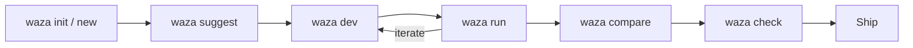
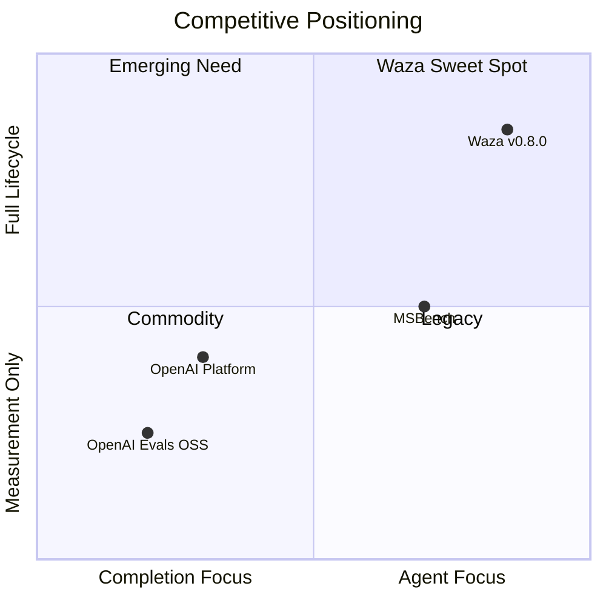

# Waza vs. OpenAI Evals: Strategic Competitive Analysis

**Date:** February 21, 2026
**Author:** Rusty (Lead/Architect), requested by Shayne Boyer
**Context:** OpenAI Evals is the most recognized open-source LLM evaluation framework. This analysis maps their capabilities against waza v0.8.0 to identify positioning advantages, gaps, and strategic moves.

---

## 1. Feature-by-Feature Comparison

| # | Area | OpenAI Evals Status | Waza v0.8.0 Status | Verdict | Notes |
|---|---|---|---|---|---|
| 1 | **Grader Types** | 4 basic (match, includes, fuzzy_match, json_match) + ModelBasedClassify | ✅ 11 types (match, regex, contains, code, prompt, diff, skill_invocation, trigger tests, etc.) with weighting | **Waza AHEAD** | Waza has 2.75× the grader variety. `diff`, `skill_invocation`, and `trigger_tests` have no OpenAI Evals equivalent |
| 2 | **LLM-as-Judge** | ModelBasedClassify with chain-of-thought, choice_scores, rubrics (fact, closedqa, battle) | ✅ `prompt` grader with rubrics, tool-based grading, `continue_session` mode, judge model separation via `--judge-model` | **Waza AHEAD** | Both have LLM-as-judge. Waza adds tool-based grading (LLM calls `set_waza_grade_pass/fail`) and separate judge model config. OpenAI Evals requires same API key for grading |
| 3 | **Agent Evaluation** | ❌ Designed for LLM completions, not agent workflows. No workspace isolation, no tool-call tracing | ✅ Full agent eval: fixture isolation (temp workspace per task), trajectory capture, tool-call tracing, session management | **Waza AHEAD** | This is the fundamental architectural gap. OpenAI Evals evaluates *completions*. Waza evaluates *agents*. Different paradigm |
| 4 | **Dashboard / UI** | ❌ OSS has none. Platform dashboard is vendor-locked to OpenAI models | ✅ React dashboard: trajectory waterfall, compare runs, trends, weighted scores, CI bands, significance badges | **Waza AHEAD** | OpenAI's OSS offering has zero visualization. Their platform dashboard exists but locks you to OpenAI models |
| 5 | **Multi-Model Support** | CompletionFn protocol abstracts model. LangChain integration available | ✅ `--model` flag for multi-model runs. Any Copilot SDK-supported model. No vendor lock-in | **Parity** | Both abstract the model layer. OpenAI Evals has broader model adapter ecosystem (LangChain, custom CompletionFns). Waza is simpler but currently Copilot SDK-focused |
| 6 | **Statistical Rigor** | ❌ No confidence intervals, no significance testing | ✅ Bootstrap CI (10K resamples, 95% confidence), normalized gain, significance badges in dashboard | **Waza AHEAD** | OpenAI Evals gives you a score. Waza tells you if that score is *statistically meaningful* |
| 7 | **CI/CD Integration** | JSONL output, no native CI reporters | ✅ JUnit XML reporter, GitHub PR comment reporter, exit codes (0/1/2), `--format junit` | **Waza AHEAD** | Waza is CI-native. OpenAI Evals requires custom parsing of JSONL logs to integrate with CI pipelines |
| 8 | **Parallelism** | Threaded execution (default 10 threads, configurable) | ✅ Go goroutine-based concurrency, multi-model parallel runs | **Parity** | Both handle parallel execution. OpenAI Evals' threading is more configurable. Waza's Go concurrency is more efficient |
| 9 | **Dataset Support** | Git-LFS stored datasets under `registry/data/`. JSONL format | ✅ CSV dataset support (`tasks_from`), template variables (`{{.Vars.column}}`), row range filtering | **Waza AHEAD** | Waza's CSV support with template variables is more ergonomic. OpenAI Evals requires Git-LFS and JSONL, heavier setup |
| 10 | **Registry / Community** | 800+ community-contributed evals via PRs. YAML-based registry | ⚠️ `registry.json` for azd extension only. No shared eval/grader registry | **OpenAI Evals AHEAD** | OpenAI Evals' community registry is massive. Waza has no equivalent shared catalog |
| 11 | **Skill/Prompt Development** | ❌ No development toolchain. Evaluation only | ✅ `waza suggest`, `waza dev`, `waza check`, `waza init`, `waza new`, trigger testing, compliance scoring | **Waza AHEAD** | OpenAI Evals is a measurement tool. Waza is a measurement + development platform |
| 12 | **Trajectory Visualization** | ❌ No trajectory support. Designed for single-turn completions | ✅ Aspire-style waterfall timeline, event-by-event tool trace, session digest, `TaskTrajectoryCompare` for run diffing | **Waza AHEAD** | Non-existent in OpenAI Evals. This is architecturally impossible for them without a fundamental redesign |
| 13 | **Distribution** | Python-only. `pip install evals`. Requires OpenAI API key for most functionality | ✅ Cross-platform Go binary (6 platforms). `install.sh` one-liner. `azd ext` distribution. No vendor API key required | **Waza AHEAD** | Waza installs in seconds on any platform. OpenAI Evals requires Python environment setup + API key |
| 14 | **Logging / Storage** | JSONL files + Snowflake integration | ✅ JSON results, evaluation caching, results served via MCP server | **Split** | OpenAI Evals has enterprise logging (Snowflake). Waza has MCP server integration. Different strengths |
| 15 | **Custom Eval Extensibility** | Python class inheriting from `evals.Eval`. Full programmatic control | ✅ `code` grader with inline scripts, `program` grader for external programs, lifecycle hooks | **OpenAI Evals AHEAD** | OpenAI Evals' Python class inheritance gives more flexibility for exotic eval types. Waza's extensibility is config-driven, which is simpler but less powerful |
| 16 | **Template Variables** | ❌ No templating system | ✅ Go `text/template` syntax. System vars (`JobID`, `TaskName`, etc.) + user `vars` map. Used in hooks, tasks, graders | **Waza AHEAD** | Dynamic test generation via templates. OpenAI Evals configs are static YAML |
| 17 | **Lifecycle Hooks** | ❌ No hooks | ✅ `before_run`/`after_run`/`before_task`/`after_task` with template variable support | **Waza AHEAD** | Setup/teardown automation. Critical for agent evaluation where workspace state matters |
| 18 | **Eval Suggestions** | ❌ Manual eval authoring only | ✅ `waza suggest` reads SKILL.md and proposes test cases, graders, fixtures via LLM | **Waza AHEAD** | Waza can bootstrap an eval suite from a skill definition. OpenAI Evals requires manual crafting of every eval |
| 19 | **MCP Integration** | ❌ No MCP support | ✅ MCP server with 10 tools for programmatic eval orchestration | **Waza AHEAD** | Waza is MCP-native. Enables agent-to-agent eval workflows |
| 20 | **Grader Weighting** | ❌ No weighting. Single score per eval | ✅ `weight` field per grader, `ComputeWeightedRunScore` for composite scoring | **Waza AHEAD** | Multi-dimensional scoring with weights. OpenAI Evals is pass/fail per sample |

---

## 2. Where Waza is AHEAD

### 🏆 Agent-Native Architecture (OpenAI Evals: Architecturally Impossible)

**OpenAI Evals' fundamental limitation:** It was designed to evaluate *completions* — single-turn or multi-turn text generation. The `evals.Eval` base class processes `(prompt, ideal)` pairs. There is no concept of:
- A workspace where an agent modifies files
- Tool-call trajectories across an agentic session
- Fixture isolation between evaluations
- Session continuity for multi-step agent tasks

**Waza's architecture:** Built from day one for agent evaluation. Each task gets a fresh temp workspace with fixtures copied in. The engine captures full tool-call trajectories. Graders can inspect both the output *and* the workspace state (via `diff` grader). This isn't a feature gap — it's a paradigm gap.

**Strategic value:** As LLM usage shifts from completions to agents, OpenAI Evals becomes increasingly irrelevant without a ground-up redesign. Waza is positioned for where the market is going.

### 🏆 Trajectory Explorer (OpenAI Evals: Non-Existent)

**OpenAI Evals logging:** JSONL event files. No visualization. No trace inspection. You get raw log lines.

**Waza reality:** Full Aspire-style waterfall timeline. Tool-call-by-tool-call trace with timing bars. Expandable event details. Session digest cards (token/turn metrics). `TaskTrajectoryCompare` for side-by-side run diffing. This is production-grade, not a prototype.

**Why this matters:** When an agent eval fails, you need to *see* what happened. Which tool was called? What did it return? Where did the agent go wrong? OpenAI Evals gives you a JSONL file to grep through. Waza gives you the answer visually.

### 🏆 Statistical Rigor (OpenAI Evals: None)

**OpenAI Evals output:** Accuracy percentage. That's it. No confidence intervals. No significance testing. No way to know if 82% → 85% is real improvement or noise.

**Waza output:** Bootstrap CI (10K resamples), 95% confidence intervals, normalized gain metrics, significance badges in the dashboard. You know when a score change is *statistically meaningful*.

**Why this matters:** Without statistical rigor, every eval run is a coin flip. You can't make shipping decisions on unqualified percentages. This is evaluation 101, and OpenAI Evals doesn't do it.

### 🏆 Development Toolchain (OpenAI Evals: Out of Scope)

OpenAI Evals is a pure measurement framework. You write your LLM application elsewhere, then evaluate it.

Waza is a complete skill development platform:



`suggest` bootstraps eval artifacts from SKILL.md. `dev` iterates on compliance. `check` validates submission readiness. `tokens` manages budget. This closed-loop development cycle has no equivalent in OpenAI Evals.

### 🏆 CI-Native Distribution (OpenAI Evals: Python-Only)

**OpenAI Evals setup:**
```bash
pip install evals          # requires Python environment
export OPENAI_API_KEY=...  # requires vendor API key
oaieval gpt-4 my-eval      # vendor-locked CLI
```

**Waza setup:**
```bash
curl -fsSL https://raw.githubusercontent.com/spboyer/waza/main/install.sh | bash
waza run eval.yaml -v       # runs immediately, any model
```

Cross-platform Go binary. 6 platforms. No Python dependency. No vendor API key requirement. JUnit XML for CI. GitHub PR comments. Exit codes that CI systems understand.

---

## 3. Where OpenAI Evals is AHEAD

### 🔴 Community Registry (800+ Evals)

**What OpenAI Evals has:** 800+ community-contributed evaluations spanning math, coding, reasoning, safety, factuality, and more. YAML-defined, Git-LFS data storage. A team can discover and reuse existing evals instead of building from scratch.

**Waza gap:** No shared registry. Each project is self-contained. Graders, tasks, and fixtures can't be published or discovered across projects. `registry.json` is only for azd extension distribution.

**Priority for waza:** LOW-MEDIUM. Waza targets agent skill developers, not general LLM benchmarking. The community registry matters more for broad LLM evaluation than for focused agent skill testing. However, a shared grader/fixture registry would accelerate adoption in teams.

### 🔴 Custom Eval Class Extensibility

**What OpenAI Evals has:** Full Python class inheritance from `evals.Eval`. You can write arbitrarily complex evaluation logic with access to the full Python ecosystem. Custom metrics, custom data loading, custom grading algorithms.

**Waza gap:** Extensibility is config-driven (YAML grader definitions, `code` grader with inline scripts, `program` grader for external programs). Powerful for 95% of cases, but you can't implement a novel evaluation algorithm without modifying waza's Go source.

**Priority for waza:** MEDIUM. The `code` and `program` graders cover most needs. A plugin interface (WASM? gRPC?) would close this gap without requiring source modification.

### 🔴 Enterprise Logging (Snowflake)

**What OpenAI Evals has:** Native Snowflake integration for enterprise-scale result storage and analysis. Built-in event recording to cloud data warehouses.

**Waza gap:** Results are local JSON files. The MCP server provides programmatic access, but there's no native cloud storage integration. Enterprise teams need to build their own pipeline to persist results.

**Priority for waza:** LOW. Most waza users are individual developers or small teams. Enterprise logging is a nice-to-have, not a blocker. Could be addressed via lifecycle hooks (`after_run` → push results to storage).

### 🟡 Model Adapter Ecosystem

**What OpenAI Evals has:** CompletionFn protocol with implementations for OpenAI, LangChain, and custom models. Broader model coverage out of the box.

**Waza status:** Copilot SDK-focused. The `AgentEngine` interface is extensible, but currently ships with `CopilotEngine` and `MockEngine`. Adding a new model requires implementing the Go interface.

**Priority for waza:** MEDIUM. As waza targets agent evaluation (not raw LLM benchmarking), the Copilot SDK covers the primary use case. But supporting additional engines (direct OpenAI, Anthropic, local models) would broaden adoption.

---

## 4. Where They're Equal

| Area | Notes |
|---|---|
| **Parallelism** | Both handle concurrent execution. OpenAI Evals uses Python threads (configurable). Waza uses Go goroutines. Functionally equivalent |
| **YAML Configuration** | Both use YAML for eval definitions. Similar ergonomics, different schemas |
| **Model Abstraction** | Both abstract the model layer via interfaces (CompletionFn vs AgentEngine). Both allow custom implementations |
| **Batch Execution** | OpenAI Evals has `oaievalset` for batch runs. Waza has `--model` multi-model runs and batch `waza dev` processing |

---

## 5. Strategic Implications

### The Paradigm Shift Favors Waza

OpenAI Evals was built in 2023 for the completion era. The industry has moved to agents. Every major platform (GitHub Copilot, Cursor, Windsurf, Claude Code) now ships agentic experiences. Evaluating agents requires:

- **Workspace isolation** — agents modify files, not just generate text
- **Trajectory tracing** — multi-step tool calls, not single-turn completions
- **Composite scoring** — multiple graders with weights, not pass/fail per sample
- **Development lifecycle** — build quality in, don't just measure it after

Waza has all four. OpenAI Evals has none.

### OpenAI's Platform Dashboard Is a Red Herring

OpenAI's newer Evals API (platform.openai.com) adds a dashboard, REST API, and CI/CD integration — but it's **vendor-locked to OpenAI models**. You can't use it to evaluate Claude, Gemini, or local models. This makes it a product feature for OpenAI customers, not a competitive threat to waza's open, model-agnostic approach.

### Waza's Weakness Is Ecosystem, Not Capability

On raw features, waza wins 13 out of 20 comparison areas. But OpenAI Evals has:
- **Brand recognition** — "OpenAI" in the name
- **Community scale** — 800+ contributed evals, 15K+ GitHub stars
- **Ecosystem integration** — LangChain, LlamaIndex, etc.

Waza needs to win on *being better for the agent evaluation problem*, not on trying to match OpenAI's general-purpose LLM benchmarking scale.



---

## 6. Recommended Actions

### Tier 1: Exploit Advantages (Ship Now)

| Action | Effort | Impact |
|---|---|---|
| **Publish "Agent Eval vs LLM Eval" positioning doc** | 1 day | Frame the narrative. OpenAI Evals evaluates completions; waza evaluates agents. Make the paradigm gap explicit in marketing |
| **Add migration guide from OpenAI Evals** | 2–3 days | Show users how to convert OpenAI Evals YAML → waza eval.yaml. Lower switching cost. Target the 800+ community evals as potential converts |
| **Benchmark against OpenAI Evals on agent tasks** | 1 week | Run the same agent tasks through both frameworks. Show that OpenAI Evals *can't even express* workspace-modifying agent evaluations. Publish results |

### Tier 2: Close Gaps (Build Soon)

| Action | Effort | Impact |
|---|---|---|
| **Grader plugin interface** | 2–3 weeks | Allow custom graders without modifying Go source. WASM or external program protocol. Closes the extensibility gap |
| **Shared eval registry** | 4–6 weeks | Publish/discover/reuse eval configs across projects. Start small: curated grader templates and example evals, not a full marketplace |
| **Additional engine adapters** | 2–3 weeks | Direct OpenAI engine, Anthropic engine, local model engine. Broaden beyond Copilot SDK. Proves model-agnostic claim |

### Tier 3: Strategic Positioning (Build Later)

| Action | Effort | Impact |
|---|---|---|
| **OpenAI Evals format import** | 2 weeks | Read OpenAI Evals registry YAML and convert to waza format. Instant access to 800+ eval definitions |
| **Enterprise result storage** | 3–4 weeks | Native export to cloud storage (Azure Blob, S3, Snowflake). Lifecycle hook approach may be sufficient |
| **CompletionFn compatibility layer** | 4 weeks | Allow OpenAI Evals CompletionFn implementations to work as waza AgentEngines. Maximum ecosystem leverage |

---

## Summary Scorecard

| Dimension | Waza | OpenAI Evals | Verdict |
|---|---|---|---|
| Agent evaluation | ✅ Purpose-built | ❌ Not designed for it | **Waza wins** |
| Trajectory visualization | ✅ Waterfall + diffing | ❌ Non-existent | **Waza wins** |
| Grader variety | ✅ 11 types + weighting | ⚠️ 4 basic + model-graded | **Waza wins** |
| Statistical rigor | ✅ Bootstrap CI, significance | ❌ None | **Waza wins** |
| CI/CD integration | ✅ JUnit XML, PR comments, exit codes | ⚠️ JSONL only, DIY integration | **Waza wins** |
| Development toolchain | ✅ Full lifecycle (suggest → dev → check) | ❌ Evaluation only | **Waza wins** |
| Distribution | ✅ 6-platform Go binary | ⚠️ Python-only, API key required | **Waza wins** |
| Template variables / hooks | ✅ Full templating + lifecycle hooks | ❌ None | **Waza wins** |
| MCP integration | ✅ 10-tool MCP server | ❌ None | **Waza wins** |
| Dashboard | ✅ React dashboard (trajectory, compare, trends) | ❌ OSS: none. Platform: vendor-locked | **Waza wins** |
| Community ecosystem | ⚠️ No shared registry | ✅ 800+ community evals | **OpenAI Evals wins** |
| Custom eval extensibility | ⚠️ Config-driven (code/program graders) | ✅ Full Python class inheritance | **OpenAI Evals wins** |
| Enterprise logging | ⚠️ Local JSON only | ✅ Snowflake integration | **OpenAI Evals wins** |
| Model adapter breadth | ⚠️ Copilot SDK focused | ✅ CompletionFn + LangChain | **OpenAI Evals slight edge** |
| Brand recognition | ⚠️ Emerging | ✅ 15K+ stars, "OpenAI" brand | **OpenAI Evals wins** |

**Bottom line:** Waza wins 10 of 15 dimensions on *shipped capability*. OpenAI Evals wins on ecosystem scale and brand. But the strategic reality is starker: OpenAI Evals cannot evaluate agents without a fundamental redesign. As the industry moves from completions to agents, OpenAI Evals becomes a legacy framework for a shrinking use case. Waza is built for where the industry is going. The highest-impact move is not closing OpenAI Evals' ecosystem gaps — it's making waza's agent evaluation superiority undeniable through positioning, benchmarks, and migration tooling.
