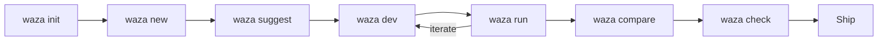
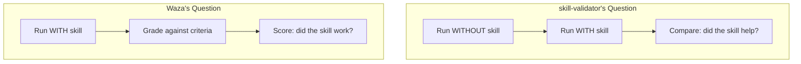
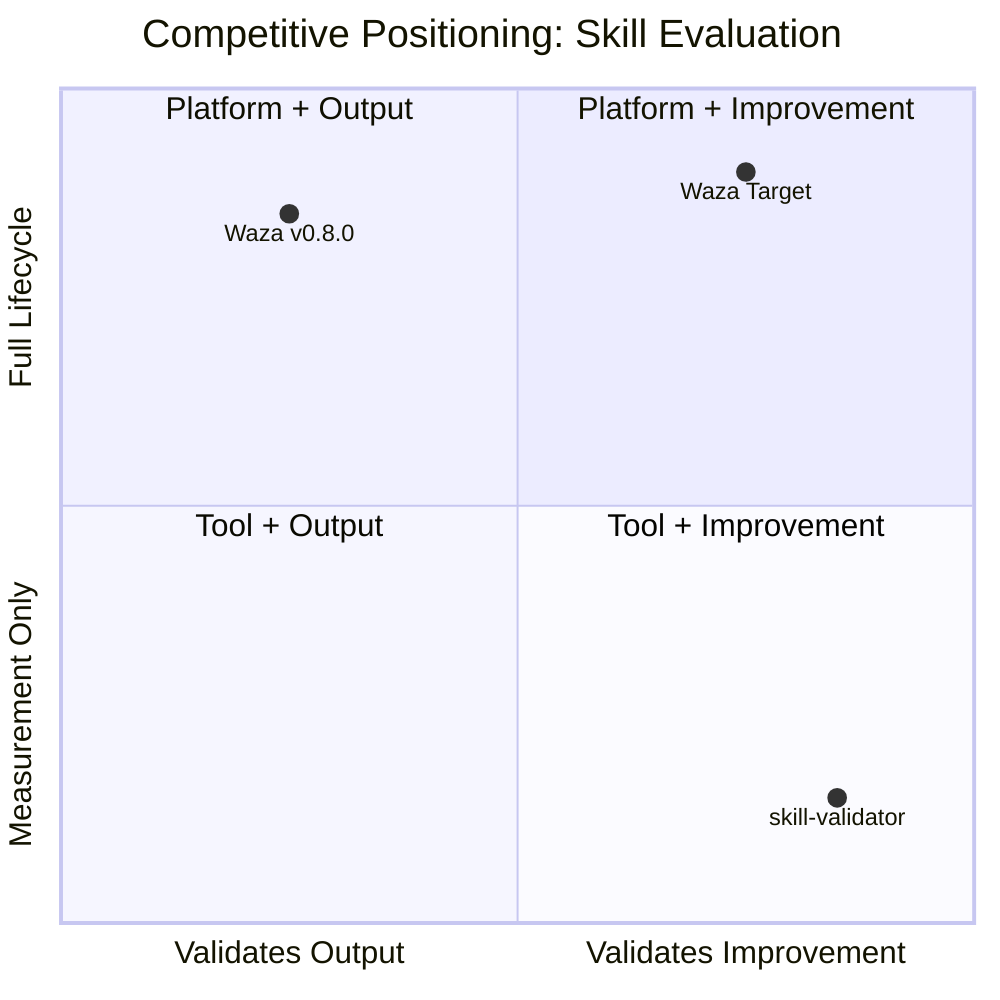

# Waza vs. skill-validator: Competitive Analysis

**Date:** February 25, 2026
**Author:** Rusty (Lead/Architect), requested by Shayne Boyer
**Context:** skill-validator is the closest competitor waza has faced — same domain (agent skill evaluation), same SDK (Copilot SDK), same eval format (YAML + scenarios). This analysis treats it as a peer, not a legacy framework.

**Repository:** [adityamandaleeka/skill-validator](https://github.com/adityamandaleeka/skill-validator)

---

## 1. Feature-by-Feature Comparison

| # | Area | skill-validator | Waza v0.8.0 | Verdict | Notes |
|---|---|---|---|---|---|
| 1 | **Core Paradigm** | A/B testing — runs agent WITH and WITHOUT skill, measures improvement | Absolute evaluation — runs agent with skill, grades against criteria | **Complementary** | Fundamentally different questions: "does this skill *help*?" vs "does this skill *work correctly*?" Both are valid |
| 2 | **Grader/Assertion Types** | 8 assertion types (output_contains/not_contains/matches/not_matches, file_exists/not_exists/file_contains, exit_success) | 11 grader types (code, prompt, regex, file, keyword, json_schema, program, behavior, action_sequence, skill_invocation, diff) | **Waza AHEAD** | Waza has 1.4× the variety, plus composite grading. skill-validator's assertions are binary pass/fail — no scoring continuum |
| 3 | **LLM-as-Judge** | Pairwise comparative judging (sees both outputs, picks winner) + independent judge. Rubric-based scoring | `prompt` grader with rubrics, `--judge-model` for separate judge model, tool-based grading (`set_waza_grade_pass/fail`) | **Split** | Different judge architectures. skill-validator's pairwise comparison is better at *relative* quality. Waza's prompt grader is better at *absolute* quality. Both have rubric support |
| 4 | **Bias Mitigation** | Position-swap bias mitigation — runs comparison twice with swapped order, checks consistency | ❌ No explicit bias mitigation for LLM judges | **skill-validator AHEAD** | Position bias in LLM judging is a documented problem. skill-validator addresses it; waza doesn't |
| 5 | **Statistical Rigor** | Bootstrap CI across multiple runs, normalized gain, significance testing, configurable confidence level | Bootstrap CI (10K resamples, 95%), normalized gain, significance badges in dashboard | **Parity** | Both take statistics seriously. skill-validator adds normalized gain as a first-class metric to control for ceiling effects. Waza has dashboard visualization of CI bands |
| 6 | **Multi-Model Comparison** | ❌ Single model per run (--model flag). No cross-model comparison | ✅ `--model` supports multiple models per run, CompareView for cross-model analysis | **Waza AHEAD** | Waza can run the same eval across Claude, GPT, Gemini in one invocation and compare results. skill-validator requires separate runs and manual comparison |
| 7 | **Dashboard / UI** | ❌ Console output + JSON/JUnit files. No web dashboard | ✅ React dashboard: trajectory waterfall, compare runs, trends, weighted scores, CI bands | **Waza AHEAD** | skill-validator is CLI-only. Waza provides rich visual exploration of results, trajectories, and trends |
| 8 | **Trajectory Visualization** | ❌ No trajectory capture or visualization | ✅ Aspire-style waterfall timeline, event-by-event tool trace, session digest, trajectory diffing between runs | **Waza AHEAD** | When a test fails, waza shows you *exactly* what the agent did, step by step. skill-validator gives you a pass/fail verdict |
| 9 | **Tool Constraints** | `expect_tools` / `reject_tools` — assert which tools the agent should/shouldn't use. `max_turns`, `max_tokens` | ❌ No tool constraint assertions. Graders evaluate output quality, not execution behavior | **skill-validator AHEAD** | This is a real gap. "The agent should use bash but NOT create_file" is a valid skill quality signal that waza can't express |
| 10 | **Skill Discovery** | Automatic directory scanning for SKILL.md files — discovers all skills in a path | Explicit eval.yaml pointing to specific skill. `waza init` scaffolds per-skill | **skill-validator AHEAD** | skill-validator's auto-discovery is zero-config for monorepos with many skills. Waza requires explicit eval config per skill |
| 11 | **Skill Profile Analysis** | Static SKILL.md analysis — token count, sections, code blocks, SkillsBench-grounded warnings | `waza check` + `waza dev` — compliance scoring, heuristic analysis, spec validation, token counting | **Waza AHEAD** | Both analyze SKILL.md statically. Waza's analysis is deeper (spec compliance, iterative improvement loop). skill-validator cites SkillsBench findings, which is good, but waza's toolchain goes further |
| 12 | **Development Toolchain** | ❌ Validation only. No `suggest`, no `dev`, no `init`, no `new` | ✅ Full lifecycle: `init` → `new` → `suggest` → `dev` → `check` → `run` → `compare` | **Waza AHEAD** | skill-validator measures; waza measures AND builds. The development loop is waza's moat |
| 13 | **CI/CD Integration** | JUnit XML reporter, JSON reporter, console reporter | JUnit XML, GitHub PR comment reporter, exit codes (0/1/2) | **Parity** | Both CI-native. Waza adds PR comment integration. skill-validator has cleaner multi-format support |
| 14 | **File Setup / Fixtures** | Inline `content` or `source` path per scenario. Files created before each run | Fixture directory (`--context-dir`), copied to temp workspace per task. Template variables in content | **Waza AHEAD** | Both handle fixtures. Waza's temp-workspace isolation is more robust — agent edits never touch originals. Template variables add dynamism |
| 15 | **Results Persistence** | `.skill-validator-results/` with per-skill verdicts | JSON results, evaluation caching, MCP server for programmatic access | **Waza AHEAD** | Waza's caching avoids redundant LLM calls. MCP server enables agent-to-agent eval workflows |
| 16 | **Eval Caching** | ❌ No caching — every run calls the LLM | ✅ Evaluation caching — skip re-running unchanged tasks | **Waza AHEAD** | At 5 runs × N scenarios × 2 (with/without), skill-validator's LLM costs add up fast. Waza can cache and skip |
| 17 | **Weighted Scoring** | Fixed weights: quality 0.70, task completion 0.15, efficiency 0.15 (and finer breakdown) | User-configurable `weight` per grader. `ComputeWeightedRunScore` for composites | **Split** | skill-validator has opinionated defaults (research-backed). Waza lets users define their own weights. Different philosophies |
| 18 | **Normalized Gain** | ✅ First-class metric — controls for ceiling effects (improving 0.9 → 0.95 is harder than 0.3 → 0.5) | ⚠️ Normalized gain in stats but not prominently surfaced | **skill-validator slight edge** | Both compute it. skill-validator makes it central to the improvement score |
| 19 | **CSV Dataset Support** | ❌ No dataset/template support | ✅ `tasks_from` CSV, template variables (`{{.Vars.column}}`), row range filtering | **Waza AHEAD** | Data-driven testing at scale. skill-validator is one-scenario-at-a-time |
| 20 | **MCP Server** | ❌ No MCP support | ✅ MCP server with tools for programmatic eval orchestration | **Waza AHEAD** | Waza is MCP-native, enabling integration with other agents and tools |
| 21 | **Distribution** | Node.js (npm install + npm link). Requires Node 22+ | Cross-platform Go binary (6 platforms). `install.sh` one-liner. `azd ext` distribution | **Waza AHEAD** | Waza installs in seconds on any platform. skill-validator requires a Node.js toolchain |
| 22 | **Lifecycle Hooks** | ❌ No hooks | ✅ `before_run`/`after_run`/`before_task`/`after_task` with template support | **Waza AHEAD** | Setup/teardown automation for complex eval scenarios |
| 23 | **Strict Mode** | `--strict` / `--require-evals` — enforce that all skills have eval coverage | `waza check` validates submission readiness, but no "all skills must have evals" enforcement | **skill-validator slight edge** | Useful governance for teams. Waza's check is per-skill, not monorepo-wide |

---

## 2. Where Waza is AHEAD

### 🏆 Complete Development Lifecycle (skill-validator: Out of Scope)

skill-validator is a *validator*. It answers one question: "does this skill improve agent behavior?" That's it.

Waza is a *development platform*. It answers that question AND helps you build the skill in the first place:



`suggest` bootstraps eval artifacts from SKILL.md. `dev` iterates on compliance and quality. `check` validates readiness. `tokens` manages budget. This is the moat — skill-validator can't replicate this without becoming a different tool.

### 🏆 Trajectory Visualization (skill-validator: Non-Existent)

When a skill-validator test fails, you get a verdict and maybe a judge explanation. When a waza test fails, you get a full Aspire-style waterfall showing every tool call, every response, every timing gap. You can diff trajectories between runs to see what changed.

For agent eval, *understanding failure* is as important as *detecting failure*. Trajectory visualization turns a diagnostic dead-end into an actionable insight.

### 🏆 Multi-Model Comparison (skill-validator: Manual Only)

Waza runs the same eval across multiple models in a single invocation and surfaces deltas in the CompareView dashboard. skill-validator tests one model at a time — cross-model analysis requires separate runs and manual correlation.

This matters because skill quality isn't model-independent. A skill might help Claude but hurt GPT. Waza surfaces this; skill-validator hides it.

### 🏆 Grader Depth and Composability (skill-validator: Binary Assertions)

skill-validator's assertions are binary: pass or fail. `output_contains`, `file_exists`, `exit_success`. No scoring continuum, no composition, no weighting.

Waza's 11 grader types produce scored results (0.0–1.0), support user-defined weights, and compose into weighted aggregate scores. The `prompt` grader runs LLM-as-judge with rubrics. The `diff` grader inspects workspace state. The `program` grader calls external scripts. This is a richer evaluation vocabulary.

### 🏆 Data-Driven Testing (skill-validator: One Scenario at a Time)

Waza's `tasks_from` CSV support with template variables means you can define a scenario template and run it across hundreds of test cases. skill-validator has no dataset concept — each scenario is hand-authored. For comprehensive coverage, this doesn't scale.

---

## 3. Where skill-validator is AHEAD

### 🔴 A/B Testing Methodology — The Core Insight

This is skill-validator's defining contribution. The fundamental question it asks is different from waza's:



**Why this matters:** A skill can "work correctly" (pass waza's graders) but not actually *improve* the agent. If the agent was already good at that task without the skill, the skill adds complexity without value. skill-validator catches this; waza doesn't.

**Priority for waza:** HIGH. This is the single most important idea to adopt. See Recommended Actions.

### 🔴 Pairwise Comparative Judging with Bias Mitigation

skill-validator's pairwise judge is architecturally more sophisticated than waza's independent `prompt` grader:

1. LLM sees both outputs (with-skill and without-skill) side-by-side
2. Picks a winner with reasoning
3. Runs again with outputs swapped (position-swap)
4. Checks for consistency — if the judge picks a different winner when order changes, the result is flagged as unreliable

This addresses a known LLM judging failure mode: position bias (LLMs tend to prefer the first response shown). Waza's `prompt` grader evaluates each output independently, which doesn't capture *relative* quality and doesn't mitigate position bias.

**Priority for waza:** MEDIUM-HIGH. Pairwise judging is a proven technique in RLHF and LLM evaluation literature. Position-swap bias mitigation is cheap to implement and high-value.

### 🔴 Tool Constraint Assertions

skill-validator's `expect_tools` and `reject_tools` express behavioral requirements that waza can't:

```yaml
# "Use bash for execution but don't create files directly"
expect_tools: ["bash"]
reject_tools: ["create_file"]
```

This is particularly valuable for skill evaluation because *how* the agent solves a problem matters as much as *whether* it solves it. A skill that encourages the agent to use `create_file` for everything instead of using existing project tools is a bad skill, even if the output is correct.

**Priority for waza:** HIGH. Straightforward to implement — waza already captures tool calls in trajectories. This is a grader/assertion that inspects the trajectory, not just the output.

### 🔴 Automatic Skill Discovery

skill-validator's `skill-validator ./path/to/skills/` auto-discovers all SKILL.md files and their associated evals. No configuration per skill. No eval.yaml per skill directory. Just point at a directory tree and go.

Waza requires explicit `eval.yaml` per skill. For a monorepo with 50 skills, that's 50 files to create and maintain.

**Priority for waza:** MEDIUM. Useful for monorepo workflows. Could be a `waza run --discover ./skills/` flag.

### 🟡 SkillsBench-Grounded Profile Warnings

skill-validator's static analysis cites actual SkillsBench paper findings (e.g., "skills with >4000 tokens showed degraded performance in SkillsBench"). Waza's `waza check` has compliance rules but doesn't ground them in published research.

**Priority for waza:** LOW. Nice for credibility but not a functional gap. Could be added to `waza check` output.

---

## 4. Where They're Equal / Complementary

| Area | Notes |
|---|---|
| **Statistical rigor** | Both use bootstrap CI and significance testing. Both take multiple runs seriously. skill-validator defaults to 5 runs with configurable confidence. Waza has `trials_per_task`. Philosophically aligned |
| **Copilot SDK integration** | Both use `@github/copilot-sdk` for agent execution. Same underlying runtime. Same model access. This means results are directly comparable between tools |
| **YAML eval format** | Both use YAML for eval definitions. Different schemas but similar ergonomics. skill-validator calls them "scenarios"; waza calls them "tasks". Same concept |
| **JUnit XML output** | Both produce JUnit XML for CI integration. Same consumption pattern in GitHub Actions, Azure DevOps, etc. |
| **LLM-as-Judge** | Both have rubric-based LLM judging. skill-validator does it comparatively (pairwise); waza does it absolutely (score against criteria). Complementary approaches |
| **Fixture handling** | Both create isolated file environments per scenario. skill-validator uses inline content or source paths; waza uses `--context-dir` with temp workspace isolation. Same intent, different mechanisms |

### The Complementary-Tools Pattern

The most honest framing: **these tools answer different questions.**

| Question | Best Tool |
|---|---|
| "Does this skill produce correct output?" | **Waza** — absolute grading, 11 grader types, composite scoring |
| "Does this skill make the agent *better*?" | **skill-validator** — A/B testing, pairwise comparison, normalized gain |
| "How should I improve this skill?" | **Waza** — suggest, dev, check toolchain |
| "Is this skill ready to ship?" | **Both** — waza check + skill-validator strict mode |
| "What happened when the agent ran?" | **Waza** — trajectory visualization |
| "Which model works best with this skill?" | **Waza** — multi-model comparison |

A team could use waza for development and absolute validation, then skill-validator for A/B validation before shipping. They're not mutually exclusive.

---

## 5. Strategic Implications

### This Is the Real Threat

OpenAI Evals can't evaluate agents. MSBench is an internal platform. skill-validator is the first tool that:

1. **Same SDK** — identical Copilot SDK integration means zero switching cost
2. **Same domain** — purpose-built for agent skill evaluation, not general LLM benchmarking
3. **Same eval format** — YAML scenarios with assertions, easy to port between tools
4. **Same org** — likely same Microsoft/GitHub ecosystem, potential for institutional adoption

If skill-validator gains adoption internally at Microsoft, it becomes the default tool for skill validation. Its A/B testing methodology is compelling and easy to explain: "run with and without the skill, measure improvement." That's a simpler pitch than waza's "11 grader types with weighted scoring and trajectory visualization."

### skill-validator's Moat: The A/B Question

The A/B testing paradigm is skill-validator's permanent advantage unless waza adopts it. You cannot replicate "does this skill help?" with absolute grading alone. A skill that scores 0.9 on correctness might be adding zero value if the agent already scores 0.9 without it.

This is not a feature gap — it's a *paradigm* gap. Waza currently assumes the skill is present and grades the output. skill-validator tests the counterfactual: what happens without the skill?

### Waza's Moat: Everything Else

skill-validator is a single-purpose validator. It does one thing well — A/B skill testing — but has no:
- Development toolchain (no suggest, dev, check, init, new)
- Visualization (no dashboard, no trajectory explorer)
- Multi-model comparison
- Data-driven testing at scale (no CSV, no templates)
- Grader extensibility beyond assertions + LLM judge
- Eval caching
- MCP integration
- Cross-platform binary distribution

Waza is a *platform*. skill-validator is a *tool*. The platform wins long-term, but the tool can win on its niche.

### The Adoption Race



Waza needs to move right (adopt A/B methodology) while staying high (platform depth). skill-validator would need to move up (build a platform) to compete. Moving right is easier than moving up.

---

## 6. Recommended Actions

### Tier 1: Steal Now (High Impact, Addresses Real Gaps)

| Action | Effort | Impact |
|---|---|---|
| **Add A/B baseline mode** | 2–3 weeks | The #1 priority. Add `--baseline` flag to `waza run` that executes each task twice — once without the skill, once with — and computes improvement score. This adopts skill-validator's core insight without copying their architecture. Stores baseline results for comparison |
| **Add tool constraint grader** | 1 week | New grader type: `tool_constraint` with `expect_tools` and `reject_tools` fields. Inspects trajectory tool calls against allowlists/denylists. Waza already captures tool calls — this is just a grader that reads them |
| **Add pairwise judge mode to `prompt` grader** | 1–2 weeks | Extend `prompt` grader with `mode: pairwise` that shows the judge both outputs (baseline vs with-skill) side-by-side. Add position-swap bias mitigation (run twice, check consistency). This pairs naturally with the A/B baseline mode |
| **Add `--discover` flag to `waza run`** | 3–5 days | Walk a directory tree for SKILL.md + eval.yaml pairs. Run all discovered evals. Useful for monorepos. Doesn't change waza's explicit-config-per-skill default, just adds a convenience mode |

### Tier 2: Differentiate (Leverage Waza's Platform Strengths)

| Action | Effort | Impact |
|---|---|---|
| **A/B results in dashboard** | 1–2 weeks | CompareView already supports run comparison. Surface baseline-vs-skill deltas with normalized gain, improvement scores, and trajectory diffing between the two runs |
| **Normalized gain as first-class metric** | 3 days | Already computed but not prominent. Surface it in the run summary and dashboard when baseline data exists |
| **Eval format cross-compatibility** | 1 week | `waza import skill-validator` command that reads skill-validator's eval.yaml format and converts to waza eval.yaml. Lower switching cost. If teams start with skill-validator, make it trivial to graduate to waza |
| **SkillsBench citations in `waza check`** | 2–3 days | Add research-grounded warnings to check output where waza's heuristics align with published SkillsBench findings. Credibility boost |

### Tier 3: Strategic (Long-Term Positioning)

| Action | Effort | Impact |
|---|---|---|
| **Publish "skill validation vs skill evaluation" positioning** | 1 day | Frame the narrative: skill-validator *validates* (binary: does it help?). Waza *evaluates* (rich: how well, on what dimensions, across which models, with what trajectory?). Make the scope difference explicit |
| **Offer skill-validator as a waza plugin** | 2–3 weeks | skill-validator's A/B comparison could run as a `program` grader inside waza. Wrap skill-validator execution as a waza grader that returns improvement scores. Best-of-both-worlds positioning |
| **"waza vs" comparison page on docs site** | 2 days | Public comparison page on spboyer.github.io/waza showing waza vs skill-validator, OpenAI Evals, MSBench. Honest about gaps, clear about advantages. Builds trust through transparency |

---

## Summary Scorecard

| Dimension | Waza v0.8.0 | skill-validator | Verdict |
|---|---|---|---|
| A/B testing (with/without skill) | ❌ Not supported | ✅ Core design | **skill-validator wins** |
| Pairwise judging + bias mitigation | ❌ Independent judge only | ✅ Position-swap pairwise | **skill-validator wins** |
| Tool constraint assertions | ❌ Not supported | ✅ expect_tools / reject_tools | **skill-validator wins** |
| Skill auto-discovery | ❌ Explicit config required | ✅ Directory scanning | **skill-validator wins** |
| Grader variety & composability | ✅ 11 types, weighted scoring | ⚠️ 8 binary assertions + LLM judge | **Waza wins** |
| Dashboard / trajectory visualization | ✅ Full React dashboard | ❌ Console + JSON only | **Waza wins** |
| Multi-model comparison | ✅ Single-run multi-model | ❌ One model per run | **Waza wins** |
| Development toolchain | ✅ Full lifecycle (suggest → dev → check) | ❌ Validation only | **Waza wins** |
| Data-driven testing (CSV/templates) | ✅ tasks_from, template variables | ❌ Hand-authored scenarios | **Waza wins** |
| Eval caching | ✅ Skip unchanged tasks | ❌ Full re-run every time | **Waza wins** |
| MCP integration | ✅ MCP server with tools | ❌ None | **Waza wins** |
| Distribution | ✅ 6-platform Go binary | ⚠️ Node.js 22+ required | **Waza wins** |
| Lifecycle hooks | ✅ before/after run/task | ❌ None | **Waza wins** |
| Statistical rigor | ✅ Bootstrap CI, significance | ✅ Bootstrap CI, normalized gain | **Parity** |
| CI/CD integration | ✅ JUnit, PR comments, exit codes | ✅ JUnit, JSON, console | **Parity** |

**Bottom line:** Waza wins 9 of 15 dimensions on shipped capability. skill-validator wins 4, with 2 at parity. But skill-validator's 4 wins are *concentrated in its core insight* — A/B testing, comparative judging, tool constraints, and auto-discovery. These aren't peripheral features; they're a coherent methodology for answering "does this skill improve the agent?"

Waza's wins are broader but more diffuse — platform depth, visualization, toolchain, distribution. The strategic move is clear: **adopt skill-validator's core methodology (A/B baseline, pairwise judging, tool constraints) while maintaining waza's platform advantages.** This turns a peer competitor into a feature set we've absorbed, and positions waza as the tool that does everything skill-validator does *plus* everything else.

The worst outcome is ignoring skill-validator's A/B insight and letting it become the "correct" way to validate skills while waza is seen as "just an eval runner." The best outcome is shipping `--baseline` mode before skill-validator ships a dashboard.
