# Web UI Competitive Analysis — Waza Dashboard (Issue #14)

**Date:** February 2026
**Audience:** Waza product team, engineering leads
**Status:** Research complete, ready for design review
**Related:** [Issue #14 — Web UI](https://github.com/spboyer/waza/issues/14) · [Issue #16 — JSON-RPC Server](https://github.com/spboyer/waza/issues/16) · [Issue #21 — Session Logging](https://github.com/spboyer/waza/issues/21) · [Issue #194 — A/B Baseline](https://github.com/spboyer/waza/issues/194) · [MSBench](https://github.com/devdiv-microsoft/MicrosoftSweBench) (internal)

---

## 1. Executive Summary

Waza is a CLI-first developer tool — and that's its strength. But as evaluations grow more complex (multi-model runs, A/B baselines, lifecycle hooks, LLM-as-judge), the terminal becomes a bottleneck for understanding results. Issue #14 proposes a Web UI to surface evaluation data visually, and several shipped features now provide the data layer to support it:

- **JSON-RPC server** (#16 / PR #198) — structured API for querying evaluation state
- **Session logging** (#21 / PR #197) — persistent evaluation history
- **A/B baseline measurement** (#194 / PR #196) — skill impact metrics ready for visualization
- **GroupBy results** (#188) — dimensional analysis (by model, scenario)
- **CSV dataset support** (#187) — large-scale evaluation runs generating more data

This document analyzes four reference products — an internal DevEx Token Efficiency Benchmark Dashboard, OpenAI Evals Dashboard, SkillsBench, and Microsoft MSBench — to identify patterns, gaps, and a phased MVP plan for the waza Web UI.

**Bottom line:** The DevEx dashboard provides our primary design template. We should adopt its dark-theme KPI card layout, scenario comparison tables, and trend charts while adding waza-specific features like skill impact visualization and compliance scoring.

---

## 2. Competitive Feature Matrix

| Feature | OpenAI Evals | SkillsBench | DevEx Dashboard | MSBench (internal) | Waza (Planned) |
|---------|:------------:|:-----------:|:---------------:|:------------------:|:--------------:|
| **Results Overview** | | | | | |
| KPI summary cards | ❌ | ❌ | ✅ 7 cards (runs, success rate, tokens, cost, duration, premium requests) | ✅ Run stats, resolve rate, error counts | 🎯 Phase 1 |
| Pass/fail results table | ✅ | ✅ | ✅ Recent Runs table with outcome badges | ✅ Runs page with status, tags, in-progress indicators | 🎯 Phase 1 |
| Run detail drill-down | ✅ Trace-level | ✅ Trajectory view | ✅ Clickable Run IDs | ✅ Run Analysis with tabbed "Run Insights" section | 🎯 Phase 2 |
| AI-generated insights | ❌ | ❌ | ✅ Auto-summary panel | ❌ | 🎯 Phase 3 |
| **Comparison & Analysis** | | | | | |
| Model comparison | ✅ Bar/line charts | ✅ Leaderboard | ✅ Multi-model series | ✅ Model discovery, ranked by resolve rate | 🎯 Phase 2 |
| Scenario comparison table | ❌ | ❌ | ✅ With P50 metrics, delta coloring | ✅ Issue grouping in output tables, benchmark-level stats | 🎯 Phase 2 |
| A/B skill impact view | ❌ | ✅ With/without-skills | ❌ | ❌ | 🎯 Phase 2 |
| Confidence intervals | ❌ | ✅ | ❌ | ✅ Pass@k / repeat instances | 🎯 Phase 3 |
| Merged runs comparison | ❌ | ❌ | ❌ | ✅ Merge + compare across runs | 🎯 Phase 3 |
| **Charts & Trends** | | | | | |
| Token usage trends | ❌ | ❌ | ✅ Tokens-per-run line chart | ✅ Custom metrics (token usage via post-processing) | 🎯 Phase 2 |
| Cost trends | ❌ | ❌ | ✅ Cost-per-run line chart | ❌ | 🎯 Phase 2 |
| Resolve rate over time | ❌ | ❌ | ❌ | ✅ Trendlines, clickable legend, reflowing dates | 🎯 Phase 2 |
| Tool usage breakdown | ❌ | ❌ | ✅ Horizontal bar chart | ✅ Custom metrics (tool invocation counts) | 🎯 Phase 3 |
| Success rate by scenario | ❌ | ❌ | ✅ Vertical bar chart | ✅ By benchmark, by model | 🎯 Phase 2 |
| **Workflow Integration** | | | | | |
| CI/CD integration | ✅ | ❌ | ❌ | ✅ Smoketest before large runs, AME production env | 🎯 Phase 3 |
| Configurable scoring | ✅ | ❌ | ❌ | ✅ Grader SDK v0 (custom graders, env-agnostic) | ✅ Already in CLI (8 grader types) |
| Downloadable reports | ❌ | ✅ | ❌ | ✅ Customizable report views, CLI `report` command | 🎯 Phase 3 |
| Domain/label filtering | ❌ | ✅ | ✅ Filter tabs (Efficiency, Tokens, Cost, Time) | ✅ Tags redesign with category icons, benchmark filtering | 🎯 Phase 2 |
| Re-run / retry failed | ❌ | ❌ | ❌ | ✅ Re-Run button, re-run errored instances | ✅ Already in CLI (max_attempts) |
| **Waza-Specific** | | | | | |
| Compliance score (Sensei) | ❌ | ❌ | ❌ | ❌ | 🎯 Phase 2 |
| Skill impact delta (A/B) | ❌ | ✅ | ❌ | ❌ | 🎯 Phase 2 |
| Trigger accuracy metrics | ❌ | ❌ | ❌ | ❌ | 🎯 Phase 2 |
| Trajectory/step viewer | ❌ | ✅ | ❌ | ✅ Task log web viewer (planned), trajectory reporting | 🎯 Phase 3 |
| **Design & UX** | | | | | |
| Dark theme | ❌ | ❌ | ✅ Gradient (purple → blue → teal) | Unknown (Entra ID-gated, not inspectable) | 🎯 Phase 1 |
| Responsive layout | ✅ | ✅ | ✅ | ✅ | 🎯 Phase 1 |
| Real-time updates | ❌ | ❌ | ❌ | ✅ Auto-refresh on runs page (planned) | 🎯 Phase 3 (via JSON-RPC) |
| Persistent views / permalinks | ❌ | ❌ | ❌ | ✅ Planned | 🎯 Phase 3 |

---

## 3. Design Reference Analysis — DevEx Dashboard

The DevEx Token Efficiency Benchmark Dashboard (localhost:3001) is the primary design inspiration. It demonstrates a polished, data-dense evaluation dashboard purpose-built for LLM cost and performance analysis — exactly the use case waza needs.

### 3.1 What to Adopt

#### KPI Summary Cards (Top Row)

The dashboard leads with 7 summary cards providing instant orientation:

| Card | Metric | Waza Equivalent |
|------|--------|-----------------|
| Total Runs | Count of evaluation runs | Total evaluations completed |
| Scenarios | Distinct scenario count | Distinct eval specs loaded |
| Success Rate | Overall pass percentage | Overall pass rate across tasks |
| Avg Tokens | Mean token consumption | Avg tokens per task execution |
| Avg Cost | Mean cost in USD | Avg cost per task (from Copilot SDK) |
| Avg Duration | Mean execution time | Avg task duration (already tracked) |
| Avg Premium Requests | Mean premium API calls | N/A — replace with Avg Score |

**Recommendation:** Adopt the 7-card layout. Replace "Premium Requests" with **Avg Compliance Score** (from Sensei engine) or **Skill Impact Delta** (from `--baseline` runs) to differentiate from generic dashboards.

#### Scenario Comparison Table

This is the dashboard's strongest UI pattern:

- **Columns:** Scenario name, run count, success rate, P50 tokens, P50 cost, P50 duration, P50 premium requests, composite score
- **Filter tabs:** Quick switching between Efficiency, Tokens, Cost, and Time views
- **Delta indicators:** Green/red percentage badges showing improvement/regression vs. baseline
- **Sortable columns:** Click-to-sort on any metric

**Recommendation:** Adopt this table directly. Map columns to waza metrics (tasks instead of scenarios, grader scores instead of premium requests). The delta indicators are critical for `--baseline` A/B comparison — green means skills helped, red means they hurt.

#### Trend Charts

Two line charts with toggleable series:

- **Tokens per Run:** Shows token consumption over time, with individual series per model/scenario
- **Cost per Run:** Same pattern for cost tracking

Models shown include `claude-opus-4.6` and `claude-sonnet-4.5`, with costs ranging from $0 to $4.88 and durations from 35 seconds to 7.5 minutes.

**Recommendation:** Adopt both charts. Add a third for **Pass Rate over Time** — the most important trend for skill authors iterating on quality.

#### Dark Theme with Gradient Background

The deep purple → blue → teal gradient creates a distinctive, modern aesthetic. This isn't just cosmetic — dark themes reduce eye strain during extended analysis sessions, and the gradient adds visual hierarchy that separates the dashboard from generic admin panels.

**Recommendation:** Adopt the dark theme. Use Tailwind CSS dark mode utilities for implementation efficiency. The gradient can be achieved with a single CSS class.

### 3.2 What to Skip or Defer

| DevEx Feature | Decision | Rationale |
|---------------|----------|-----------|
| AI Insights panel | Phase 3 | Requires LLM integration for auto-summarization; high effort, moderate value |
| Tool Usage Breakdown | Phase 3 | Useful but not core to skill evaluation workflow |
| Premium Requests metric | Skip | Copilot-specific metric not tracked by waza |

### 3.3 Patterns Worth Noting

- **Information density is high** — the dashboard fits KPIs, a comparison table, two charts, and a runs table in a single scrollable view. No unnecessary whitespace.
- **Color semantics are consistent** — green always means improvement, red always means regression. Apply this to skill impact deltas.
- **Clickable Run IDs** link to detailed views — important for debugging failed evaluations.
- **Outcome badges** (Pass/Fail) use color-coded pills — adopt for task results.

---

## 4. Gap Analysis vs. Issue #14 Spec

Issue #14 already specifies a REST API architecture using Chi (or stdlib), `go:embed` for SPA assets, and SPA routing. Here's how the current spec maps to competitive features:

### Already Specified in #14

| Feature | Status | Notes |
|---------|--------|-------|
| REST API layer | ✅ Specified | Chi/stdlib router, JSON endpoints |
| SPA with `go:embed` | ✅ Specified | Single binary distribution — key advantage |
| Static file serving | ✅ Specified | SPA routing with fallback |
| Results data endpoint | ✅ Specified | Serves evaluation JSON |

### Missing from Current Spec (Informed by Competitors)

| Feature | Priority | Source Inspiration |
|---------|----------|--------------------|
| KPI summary endpoint (`/api/summary`) | P0 | DevEx Dashboard |
| Runs list endpoint (`/api/runs`) | P0 | DevEx Dashboard, OpenAI Evals |
| Run detail endpoint (`/api/runs/:id`) | P1 | DevEx Dashboard (clickable IDs), OpenAI Evals (trace drill-down) |
| Trend data endpoint (`/api/trends`) | P1 | DevEx Dashboard (line charts) |
| Scenario comparison endpoint (`/api/scenarios`) | P1 | DevEx Dashboard (comparison table) |
| Skill impact endpoint (`/api/skill-impact`) | P1 | SkillsBench (A/B comparison), #194 |
| WebSocket/SSE for live updates | P2 | Unique to waza — no competitor has this |
| Export endpoint (`/api/export`) | P2 | SkillsBench (downloadable reports) |

### Shipped Infrastructure That Supports #14

| Feature | Issue/PR | What It Provides |
|---------|----------|------------------|
| JSON-RPC server | #16 / PR #198 | Structured query protocol — can serve as data layer |
| Session logging | #21 / PR #197 | Persistent evaluation history for trends/comparison |
| A/B baseline | #194 / PR #196 | `skill_impact` metrics for visualization |
| GroupBy results | #188 | Dimensional data for scenario tables |
| Multi-model runs | #39 | Cross-model data for comparison charts |
| Lifecycle hooks | #191 | Timing data for duration charts |
| Result caching | #150 | Incremental data for trend analysis |

---

## 5. MVP Recommendation — Phased Approach

### Phase 1: Core Dashboard (MVP)

**Goal:** Replace `results.json` inspection with a visual overview.
**Effort:** ~2 weeks
**Data source:** JSON-RPC server + session logs

#### Features

| Feature | Description | Design Reference |
|---------|-------------|------------------|
| **KPI cards** | 5-6 summary cards: Total Runs, Tasks, Pass Rate, Avg Tokens, Avg Cost, Avg Duration | DevEx top row |
| **Recent Runs table** | Sortable table: Run ID, Eval Spec, Model, Pass/Fail (badge), Tokens, Cost, Duration, Timestamp | DevEx Recent Runs |
| **Run detail view** | Click a run → see per-task results with grader outcomes | OpenAI Evals drill-down |
| **Dark theme** | Gradient background, consistent color palette | DevEx aesthetic |
| **`go:embed` SPA** | Single binary, no separate frontend deployment | #14 architecture |

#### API Endpoints (Phase 1)

```
GET  /api/health          → { "status": "ok" }
GET  /api/summary         → { totalRuns, totalTasks, passRate, avgTokens, avgCost, avgDuration }
GET  /api/runs            → [{ id, spec, model, outcome, tokens, cost, duration, timestamp }]
GET  /api/runs/:id        → { ...run, tasks: [{ name, outcome, score, graderResults }] }
GET  /                    → SPA (embedded via go:embed)
```

#### Wireframe

```mermaid
graph LR
    A["🔥 waza | v0.5<br/>Stats: 12 Runs, 47 Tasks, 72% Pass, 8,421 Avg Tokens, $1.24 Avg Cost, 2m 15s Avg Duration"]
    B["Recent Runs<br/>Filter ▾"]
    
    C["#a3f | code-explain | claude-4.6 | ✅ 4/5 | 12,041 tokens | $2.10 | 3m12s"]
    D["#b7c | code-explain | sonnet-4.5 | ❌ 2/5 | 6,320 tokens | $0.88 | 1m47s"]
    E["#c91 | skill-check | claude-4.6 | ✅ 3/3 | 4,902 tokens | $1.44 | 2m05s"]
    
    A --> B
    B --> C
    B --> D
    B --> E
    
    style A fill:#fff3e0
    style B fill:#f5f5f5
    style C fill:#c8e6c9
    style D fill:#ffcdd2
    style E fill:#c8e6c9
```



---

### Phase 2: Charts & Comparison

**Goal:** Enable cross-model and cross-scenario analysis.
**Effort:** ~2-3 weeks
**Depends on:** Phase 1, `--baseline` data availability

#### Features

| Feature | Description | Design Reference |
|---------|-------------|------------------|
| **Scenario comparison table** | P50 metrics per eval spec, delta indicators (green/red) vs baseline | DevEx scenario table |
| **Trend charts** | Tokens/run and Cost/run over time, toggleable series per model | DevEx trend charts |
| **Pass rate by scenario** | Bar chart showing success rates across eval specs | DevEx success chart |
| **Model comparison view** | Side-by-side metrics for runs using different models | OpenAI Evals, SkillsBench leaderboard |
| **Skill impact panel** | A/B delta visualization: pass rate with skills vs. without | SkillsBench, #194 |
| **Compliance score display** | Sensei engine scores shown per skill/task | Unique to waza |
| **Filter tabs** | Switch views: Efficiency, Tokens, Cost, Time | DevEx filter tabs |

#### API Endpoints (Phase 2)

```
GET  /api/scenarios       → [{ name, runs, passRate, p50Tokens, p50Cost, p50Duration, score }]
GET  /api/trends          → { tokens: [{date, value, model}], cost: [...], passRate: [...] }
GET  /api/skill-impact    → [{ task, passRateWithSkills, passRateBaseline, delta, percentChange }]
GET  /api/models          → [{ model, runs, passRate, avgTokens, avgCost }]
```

---

### Phase 3: Advanced Features

**Goal:** Differentiate waza's dashboard from generic eval viewers.
**Effort:** ~3-4 weeks
**Depends on:** Phase 2, additional backend instrumentation

#### Features

| Feature | Description | Design Reference |
|---------|-------------|------------------|
| **AI Insights panel** | LLM-generated summary of recent runs ("7 runs across 5 scenarios with 73% success…") | DevEx AI Insights |
| **Trajectory viewer** | Step-by-step agent actions within a task (tool calls, file edits, skill invocations) | SkillsBench |
| **Tool usage breakdown** | Horizontal bar chart of tool call frequency across runs | DevEx tool usage |
| **Live evaluation stream** | Real-time progress via WebSocket/SSE during `waza run` | Unique to waza |
| **Trigger accuracy dashboard** | Visualize `trigger_tests.yaml` results (precision, recall, F1) | Unique to waza |
| **Export / CI badge** | Download results as CSV/PDF, embeddable status badges | SkillsBench reports |
| **Confidence intervals** | Statistical bounds on metrics across trials | SkillsBench |

---

## 6. Tech Stack Recommendations

### Frontend

| Choice | Recommendation | Rationale |
|--------|---------------|-----------|
| **Framework** | React 19 (Vite) | Dominant ecosystem, large component library availability, team familiarity. Vite for fast builds — output embeds via `go:embed`. |
| **Styling** | Tailwind CSS v4 | Utility-first, excellent dark mode support, small bundle size. Matches DevEx dashboard aesthetic with minimal CSS. |
| **Charts** | Recharts | React-native, composable, good defaults for line/bar charts. Lighter than Chart.js for React integration. |
| **Tables** | TanStack Table | Headless, sortable, filterable — handles the scenario comparison table and runs table. |
| **State** | React Query (TanStack Query) | Server-state management for API calls with caching, refetching, optimistic updates. |
| **Icons** | Lucide React | Lightweight, consistent icon set. |

#### Why Recharts over Chart.js

| Criterion | Recharts | Chart.js |
|-----------|----------|----------|
| React integration | Native (JSX components) | Wrapper library needed (react-chartjs-2) |
| Bundle size | ~45 KB (tree-shakeable) | ~65 KB (monolithic) |
| Customization | Component composition | Configuration objects |
| TypeScript | First-class | Community types |
| Learning curve | React-native patterns | Canvas API concepts |

**Verdict:** Recharts for Phase 1-2. Evaluate D3 only if Phase 3 trajectory viewer needs custom visualizations.

### Backend

The backend is already specified by #14's architecture:

| Choice | Recommendation | Rationale |
|--------|---------------|-----------|
| **Router** | `net/http` (Go 1.22+ patterns) | stdlib is sufficient; avoids Chi dependency for simple API |
| **Embedding** | `go:embed` | Single binary distribution — critical for waza's "just works" philosophy |
| **Data source** | JSON-RPC server (#16) + session logs (#21) | Already shipped; Web UI reads from existing data layer |
| **API format** | REST (JSON) | Simpler than exposing JSON-RPC to the frontend; REST endpoints wrap RPC calls |

### Build Pipeline

```
web/
├── src/                    # React source
│   ├── components/
│   │   ├── KPICards.tsx
│   │   ├── RunsTable.tsx
│   │   ├── RunDetail.tsx
│   │   └── charts/
│   ├── hooks/              # React Query hooks
│   ├── api/                # API client
│   ├── App.tsx
│   └── main.tsx
├── public/
├── index.html
├── package.json
├── vite.config.ts
├── tailwind.config.ts
└── tsconfig.json

# Build produces:
web/dist/                   # Embedded via go:embed in Go binary
```

Build command: `cd web && npm run build` → outputs to `web/dist/` → Go binary embeds at compile time.

---

## 7. User Workflow

The waza Web UI dashboard is designed as a **CLI-first, dashboard-second** experience. Users run evaluations from the terminal, then visualize and analyze results in the browser. This section describes the complete end-to-end journey.

### End-to-End User Journey

#### 1. Run Evals from CLI
The user executes evaluations from the command line using the existing `waza run` command:
```bash
waza run examples/code-explainer/eval.yaml --context-dir examples/code-explainer/fixtures -o results.json
```
This produces:
- **JSON results file** (`results.json`) containing benchmark metadata, test cases, and evaluation outcomes
- **Session logs** containing detailed execution traces, agent trajectories, and grader outputs

#### 2. Launch the Dashboard
The user starts the Web UI server with a single command:
```bash
waza serve
```
The `waza serve` command:
- Launches an embedded HTTP server (default port `3000`, configurable via `--port`)
- Automatically opens the browser at `http://localhost:3000`
- Prints the dashboard URL to the terminal for reference
- Loads results from JSON files and session logs in the default directory (or via `--results-dir`)

#### 3. Orient — KPI Cards (Phase 1)
The dashboard landing page displays 5–6 summary cards providing instant orientation:
- **Total Runs** — count of all evaluations executed
- **Tasks** — count of test cases across all runs
- **Pass Rate** — percentage of tasks passing all graders
- **Avg Tokens** — average token consumption per run
- **Avg Cost** — estimated cost per run (based on model pricing)
- **Avg Duration** — average time per run in seconds

These cards require no clicking — the user understands the evaluation health at a glance.

#### 4. Browse Runs — Recent Runs Table (Phase 1)
Below the KPI cards, a sortable table lists all evaluation runs in reverse chronological order:
- **Columns:** Run ID, Timestamp, Model, Task Count, Pass Count, Pass Rate, Avg Tokens, Total Cost, Duration
- **Sorting:** Click any column header to sort
- **Row drill-down:** Click a run row to expand per-task results showing:
  - Task name and description
  - Grader outcomes (pass/fail badges)
  - Numerical scores from each grader
  - Which graders fired for this task

#### 5. Compare — Model & Scenario Analysis (Phase 2)
A **Comparison view** allows side-by-side analysis across dimensions:
- **Filter tabs:** Switch between Efficiency (tokens/run), Cost, Time, and Quality views
- **Delta indicators:** Red/green badges showing improvement or regression vs. a baseline run
- **Model comparison:** Side-by-side metrics for different models (e.g., claude-opus-4.6 vs sonnet-4.5)
- **Compliance scores:** Sensei engine compliance scoring per skill, displayed as pass/fail indicators or percentages

The user can select two runs and see detailed deltas across all metrics.

#### 6. Trend — Over Time (Phase 2)
Line charts visualize performance trends:
- **Tokens/run over time** — track whether recent skill iterations have improved or increased token usage
- **Cost/run over time** — monitor spending trends and cost-saving opportunities
- **X-axis:** Chronological run dates (e.g., last 30 days)
- **Y-axis:** Metric value (tokens, cost, duration)
- **Multiple series:** Option to overlay trends from different models or skills

This helps teams identify regressions early and celebrate improvements.

#### 7. Deep Dive — Trajectory & Live Stream (Phase 3)
Advanced exploration features for detailed investigation:
- **Live streaming:** Watch `waza run` execute in real-time via Server-Sent Events (SSE). Progress updates appear on the dashboard without page refresh.
- **Agent trajectory:** Click into a task to view the full execution trace:
  - Tool calls (with arguments and responses)
  - File edits (diffs of changes made)
  - Skill invocations and their outcomes
  - LLM reasoning steps (if available)
- **CSV export:** Download run results as a CSV file for use in spreadsheets or external analytics

### CLI-First, Dashboard-Second

**Key positioning insight:** Waza's workflow inverts the traditional dashboard-first model used by competitors.

| Aspect | Waza | SkillsBench | MSBench |
|--------|------|-------------|---------|
| **Primary interface** | CLI | Dashboard | CLI only |
| **Eval execution** | `waza run` (terminal) | Web UI form | `msbench eval` (terminal) |
| **Results view** | `waza serve` (browser) | Automatic | External reporting |
| **Deployment** | Single binary (go:embed) | Separate deployment | No dashboard |
| **UX philosophy** | Run → Understand → Iterate | Dashboard → Run | Run → Export → Analyze |

**Why CLI-first?**
1. **Power users start here:** Engineers and CI/CD pipelines naturally work in the terminal
2. **Reproducibility:** Every eval is a documented CLI invocation (easy to version control and share)
3. **Integration:** `waza run` output feeds directly into dashboards, monitoring, and post-processing scripts
4. **Single binary:** The `go:embed` approach means `waza serve` is bundled automatically — no separate installation, no deployment complexity

The dashboard is the **second step** — you've already run your evals, collected the data, and now you want to understand what happened. This is a fundamental shift from SkillsBench (dashboard-first) and MSBench (CLI-only with no dashboard).

### Workflow Diagram

```
┌──────────────┐
│  CLI         │
│ waza run     │  User executes evaluations from terminal
│  eval.yaml   │  → Produces: results.json + session logs
└──────┬───────┘
       │
       ↓
┌──────────────────────┐
│  Results             │
│  (JSON + logs)       │  Data accumulated locally
└──────┬───────────────┘
       │
       ↓
┌──────────────┐
│ Dashboard    │
│ waza serve   │  Single binary, embedded SPA
│ :3000        │  → Visualize and analyze results
└──────┬───────┘
       │
       ↓
┌──────────────┐
│  Iterate     │  Run new evals with improvements
│  (Loop back) │  → Track trends over time
└──────────────┘
```

---

## 8. Key Design Questions

These are open decisions for the team before implementation begins:

### Q1: Standalone server or embedded in `waza` CLI?

| Option | Pros | Cons |
|--------|------|------|
| **`waza serve`** subcommand | Single binary, no extra install, discoverable | CLI binary grows by ~2-3 MB (embedded SPA) |
| **Separate `waza-ui` binary** | Smaller CLI, independent release cycle | Extra install step, breaks "just works" principle |

**Recommendation:** `waza serve` subcommand. The embedded SPA adds ~2-3 MB to the binary — acceptable given the value. This matches the `go:embed` architecture in #14 and keeps the single-binary distribution model.

### Q2: Data persistence — file-based or SQLite?

| Option | Pros | Cons |
|--------|------|------|
| **JSON files** (current `results.json`) | Zero dependencies, easy to inspect | No indexing, slow for trends across many runs |
| **SQLite** | Fast queries, trend support, built-in indexing | Adds dependency (though pure-Go drivers exist) |

**Recommendation:** Start with JSON files (Phase 1) backed by session logs (#21). Migrate to SQLite in Phase 2 when trend queries become necessary. Use `modernc.org/sqlite` for pure-Go, zero-CGO SQLite.

### Q3: Real-time updates — SSE or WebSocket?

| Option | Pros | Cons |
|--------|------|------|
| **SSE (Server-Sent Events)** | Simple, HTTP-native, one-directional | No bidirectional communication |
| **WebSocket** | Bidirectional, lower latency | More complex, needs connection management |
| **Polling** | Simplest to implement | Higher latency, more requests |

**Recommendation:** Polling for Phase 1 (simplest). SSE for Phase 3 live streaming — evaluation progress is inherently one-directional (server → client), making SSE the right fit. WebSocket only if bidirectional features are needed later.

### Q4: Port and discovery

- Default port: `3000` (or `3001` following DevEx dashboard convention)
- Auto-open browser on `waza serve`?
- Print URL to terminal: `Dashboard available at http://localhost:3000`

### Q5: Authentication

For local development use, no authentication is needed. If waza serve is ever exposed to a network, add an optional `--token` flag for bearer token auth. This is a Phase 3+ concern.

---

## Appendix A: Competitor Deep Dives

### A.1 OpenAI Evals Dashboard

**Strengths:**
- Tight CI/CD integration — evals run automatically on model changes
- Configurable scoring criteria — developers define what "pass" means
- Trace-level drill-down — see exactly what the model did at each step
- Model comparison views — side-by-side output comparison

**Weaknesses:**
- OpenAI-ecosystem locked — only works with OpenAI models
- No cost/token visualization — focused on accuracy, not efficiency
- No skill/tool impact measurement — no A/B comparison
- Limited trend analysis — focuses on point-in-time snapshots

**Takeaway for waza:** Adopt the drill-down pattern (summary → run → task → trace). Skip the CI/CD integration for MVP — waza already has GitHub PR comment reporting (#140).

### A.2 SkillsBench (skillsbench.ai)

**Strengths:**
- Leaderboard with with/without-skills comparison — directly measures skill impact
- Trajectory viewing — step-by-step visualization of agent actions
- Confidence intervals on metrics — statistical rigor
- Multi-agent support — Claude, Codex, OpenCode, Goose, Factory
- Downloadable reports — shareable results

**Weaknesses:**
- Slow execution — Docker containers add minutes to each run
- No real-time feedback — batch-oriented, not interactive
- Research-focused — not optimized for iterative development
- No compliance scoring — doesn't evaluate skill quality

**Takeaway for waza:** Adopt the with/without-skills comparison view (directly maps to `--baseline` / #194). The trajectory viewer is high-value for Phase 3 — skill authors need to see *how* the agent used their skill. Confidence intervals add credibility to small-sample evaluations.

### A.3 DevEx Token Efficiency Benchmark Dashboard

**Strengths:**
- Information-dense single-page layout — all metrics visible without navigation
- Excellent use of color semantics — green/red deltas, outcome badges
- Practical metrics — tokens, cost, duration alongside accuracy
- Filter tabs — quick context switching between efficiency dimensions
- AI Insights — automated narrative summarization of results

**Weaknesses:**
- Internal tool — not publicly available, no community feedback
- No skill/A/B comparison — efficiency-focused, not skill-impact-focused
- No trajectory/trace view — results-only, no process visibility
- Static dashboard — no real-time evaluation streaming

**Takeaway for waza:** This is our primary design template. Adopt the layout, color system, and information hierarchy. Extend with skill-specific panels (impact delta, compliance score, trigger accuracy) that no competitor offers.

### A.4 Microsoft MSBench (devdiv-microsoft/MicrosoftSweBench)

> **Note:** MSBench is an internal Microsoft platform. The GitHub repo is an issue tracker only (421+ open issues); actual code lives in Azure DevOps repos. The web UI at `msbenchapp.azurewebsites.net` requires Entra ID authentication and was not directly inspectable — findings below are derived from 1,200+ issues mined from the GitHub tracker.

**What MSBench Is:**

MSBench is Microsoft's internal agent benchmarking platform for evaluating AI coding agents (Copilot, 3P agents) against real-world software engineering tasks. It uses Harbor-format containerized benchmarks on both Windows and Linux, with a Kusto data layer for analytics and a web frontend for reporting.

**Architecture:**
- **CLI:** `msbench-cli` (Python) with `report`, `extract`, `run`, `status` commands
- **Data layer:** Kusto DB with custom KQL functions for querying benchmark instances
- **Web UI:** Azure App Service (`msbenchapp.azurewebsites.net`) with Entra ID auth
- **Execution:** Azure Storage for run queuing, AME (Azure Managed Environment) for production
- **Agent integration:** "Special agents" shim pattern, CES CAPI proxy for Copilot API access
- **Grading:** Grader SDK v0 being designed — custom graders, environment-agnostic

**Shipped UI Features (from closed issues):**
- Resolve rate over time chart with trendlines, clickable legend, reflowing dates (#418)
- Run Analysis page with tabbed "Run Insights" section (#1073, #1074)
- Tags redesign with grey color scheme and category icons (#1087)
- In-progress run visual indicators (#1075)
- Customizable report views (#980)
- Issue grouping in output tables (#941)
- Error reporting and aggregation (#338, #873)
- Run timestamps in reports (#938)
- Custom metrics from CLI (#848) — post-processing scripts for tool invocations, token usage, error analysis
- Merged runs support (#323, #1050)
- Model discovery feature (#1011, #1144)
- Pass@k / repeat instances (#242)

**Planned UI Features (from open issues):**
- Auto-refresh on runs page (#1224)
- Web viewer for task logs (#1223)
- Download failed/errored tasks (#1222)
- Screenshot/video preview and hover (#1195, #1196)
- Persistent reporting views / permalinks (#1185)
- Re-Run button (#1166)
- Comparison View with config diff (#1165)
- Trajectory reporting helper (#1102)
- Weekly report dashboard (#1206)
- OPS dashboard (#1138)

**Strengths:**
- **Production-grade internal platform** — used across DevDiv for agent evaluation at scale
- **Rich reporting** — customizable views, merged run comparison, issue grouping, tags with icons
- **Kusto-powered analytics** — KQL for ad-hoc queries, custom metrics post-processing
- **Grader extensibility** — designing a Grader SDK v0 for custom, environment-agnostic graders
- **Pass@k support** — repeat instances for statistical rigor
- **Model discovery** — automated detection of available models for benchmarking
- **Re-run errored instances** — resilient to transient failures

**Weaknesses:**
- **Internal only** — requires Microsoft EMU account and Entra ID, no external community
- **Issue tracker only on GitHub** — code is in Azure DevOps, hard to inspect architecture
- **No skill impact measurement** — evaluates agent performance, not skill effectiveness
- **No compliance scoring** — no quality validation of skills themselves
- **Heavy infrastructure** — Kusto DB, Azure Storage, AME, CES CAPI proxy
- **No dark theme** (as far as can be determined from issues — UI not inspectable)

**Takeaway for waza:** MSBench validates several features we should adopt: **resolve-rate-over-time charts** (directly applicable to pass-rate trends), **merged run comparison** (similar to `waza compare`), **customizable report views** (Phase 2 filter tabs), **re-run from UI** (Phase 3), and **task log web viewer** (trajectory viewer in Phase 3). Their Grader SDK v0 design is worth monitoring — our 8-grader system is more mature today, but their environment-agnostic approach could inform future grader plugins. The Kusto data layer reinforces our recommendation to migrate from JSON to SQLite in Phase 2 for query performance. Most importantly, MSBench's extensive issue backlog (421+ open) shows the UI complexity that grows when a benchmarking platform matures — our phased approach is the right strategy to avoid overbuilding.

---

## Appendix B: Waza's Unique Value in a Dashboard

No existing evaluation dashboard offers these features — they represent waza's differentiation:

| Unique Feature | Data Source | Visualization |
|----------------|-------------|---------------|
| **Sensei compliance score** | Sensei engine output | Gauge/score card per skill, trend over iterations |
| **Skill impact delta (A/B)** | `--baseline` flag (#194) | Green/red delta bars: +12% with skills vs. baseline |
| **Trigger accuracy metrics** | `trigger_tests.yaml` auto-discovery (#166) | Precision/recall/F1 gauges per skill |
| **Multi-grader results** | 8 grader types (regex, code, diff, prompt, behavior, skill_invocation, etc.) | Per-task grader breakdown table |
| **Token budget tracking** | Token management (E4 roadmap) | Budget utilization gauge, over-budget alerts |
| **Lifecycle hook timing** | `before_run`/`after_run` hooks (#191) | Gantt-style timing breakdown per task |

These features, combined with the DevEx dashboard's proven layout patterns, position the waza Web UI as the most comprehensive skill evaluation dashboard available.
